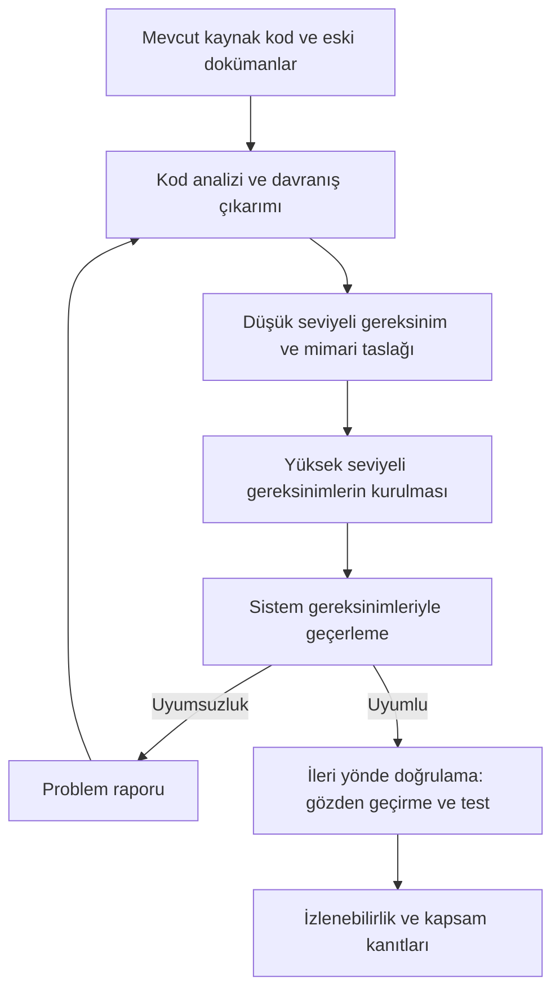

# 25. Tersine Mühendislik

Tersine mühendislik (reverse engineering), mevcut koddan gereksinim ve tasarım
bilgisini yeniden kurma çalışmasıdır. Eski veya eksik dokümantasyona sahip sistemlerde sıkça başvurulur.

Bu bölüm, bu yaklaşımın sınırlarını ve ortaya çıkarılan bilginin nasıl doğrulanması
gerektiğini anlatır.

## Neden yapılır?

Eski sistemlerde kaynak belge kaybolmuş olabilir, ekip değişmiş olabilir veya mevcut
dokümantasyon kodla uyumsuz hale gelmiş olabilir. Bu durumda davranışı anlamanın yolu
kodu dikkatle incelemektir.

## Sınırlar

Tersine mühendislikte en büyük risk, kodun gerçekten ne yaptığını değil, ne yapması
gerektiğini varsaymaktır. O yüzden çıkarılan bilgi, hemen doğru kabul edilmemelidir.

## Pratik adımlar

### Tersine mühendislikte pratik adımlar

- Kodu gözden geçirip davranış kalıplarını çıkar.
- Bulunan yapıyı gereksinimlerle eşleştir.
- Eksik kalan kısımlar için doğrulama yap.

## Ele alınması gereken konular

Tersine mühendislik bir sertifikasyon projesinde "kodu okuduk,
dokümanları yazdık" diye özetlenebilecek gayriresmî bir faaliyet olarak kalamaz.
Otorite gözünde bu yaklaşım, normal geliştirme akışının tersine işletilmesidir ve
tam da bu yüzden dört konunun baştan netleştirilmesini bekler: otoritenin
bilgilendirilmesi, sürecin planlarda tanımlanması, kaynak malzemenin konfigürasyon
yönetimi (configuration management) altına alınması ve çıkarılan gereksinimlerin
geçerlenmesi (validation).

### Otorite beklentileri

Sertifikasyon otoriteleri tersine mühendisliği yasaklamaz; ancak "ucuz bir kestirme"
olarak kullanılmasına da izin vermez. Deneyimim, şu beklentilerin hemen her projede
gündeme geldiği yönündedir:

- Yaklaşım, katılım aşaması (Stage of Involvement, SOI) toplantılarından önce,
  tercihen planlama aşamasında otoriteyle açıkça konuşulmalıdır. SOI 1'de sürpriz
  olarak ortaya çıkan bir tersine mühendislik stratejisi neredeyse her zaman bulgu
  üretir.
- Sonuçta üretilen yaşam döngüsü verileri, ileri yönde geliştirilmiş bir projeninkiyle
  **aynı kalitede** olmalıdır: yüksek ve düşük seviyeli gereksinimler
  (high-/low-level requirements), yazılım mimarisi, izlenebilirlik (traceability)
  ve doğrulama (verification) kanıtları eksiksiz beklenir.
- "Kod böyle yazılmış, demek ki gereksinim budur" mantığı kabul görmez. Kodun mevcut
  davranışı ile sistemin **istenen** davranışı ayrı ayrı ele alınmalı; farklar
  problem raporuna dönüştürülmelidir.
- Kaynak kodda bulunan ama hiçbir gereksinime bağlanamayan yapılar, ölü kod
  (dead code) veya gereksiz kod (extraneous code) olarak sınıflandırılıp
  gerekçelendirilmelidir; tersine mühendislik bu sınıflandırmadan muafiyet sağlamaz.

### Sürecin planlarda tanımlanması

Tersine mühendislik yapılacaksa bu, yazılım planlarında adıyla anılmalı ve süreç
adım adım tanımlanmalıdır. Asgari olarak planlarda şunlar yer almalıdır:

| Plan içeriği | Cevaplaması gereken soru |
|---|---|
| Kapsam | Hangi bileşenler tersine mühendisliğe tabi, hangileri yeniden yazılacak? |
| Girdi verisi | Hangi kaynak malzeme (kod, eski dokümanlar, test kayıtları) kullanılacak? |
| Üretilecek veri | Hangi yaşam döngüsü verileri, hangi sırayla yeniden kurulacak? |
| Geçiş kriterleri | Bir adım ne zaman "tamamlandı" sayılır, geri dönüşler nasıl yönetilir? |
| Doğrulama ve geçerleme | Çıkarılan gereksinimler kime, hangi yöntemle onaylatılacak? |
| Araçlar | Statik analiz veya kod anlama araçları kullanılacaksa araç kalifikasyonu (tool qualification) gerekiyor mu? |

Sürecin kendisi genellikle şu akışla işler:

Dikkat edilmesi gereken nokta, akışın sonunda ok yönünün tekrar "ileri" dönmesidir:
gereksinimler bir kez kurulduktan sonra doğrulama, sanki proje baştan ileri yönde
geliştirilmiş gibi gereksinimlerden koda doğru yapılır.

### Kaynak malzemenin konfigürasyon kontrolü

Tersine mühendisliğin girdisi olan kod ve eski dokümanlar çoğu zaman dağınıktır:
farklı sürümler, yerel kopyalar, hangi ikiliye karşılık geldiği belirsiz kaynak
ağaçları. Bu malzeme konfigürasyon yönetimi altına alınmadan analiz başlarsa, üç ay
sonra "hangi kodu tersine mühendislikten geçirdik?" sorusuna cevap verilemez.

- Analize başlamadan önce kaynak kodun **tek ve tanımlı bir taban çizgisi** (baseline)
  oluşturulmalı; sahadaki çalıştırılabilir nesne kodu (executable object code) ile bu
  kaynağın eşleştiği gösterilebilmelidir.
- Eski dokümanlar, test kayıtları ve servis geçmişi de aynı taban çizgisine referansla
  saklanmalıdır; bunlar "güvenilir gerçek" değil, **girdi verisi** statüsündedir.
- Analiz sırasında kodda düzeltme ihtiyacı doğarsa değişiklik, normal problem raporu
  ve değişiklik kontrol mekanizmasından geçmelidir; "nasılsa her şeyi yeniden
  yazıyoruz" rahatlığıyla kontrolsüz düzenleme yapılmamalıdır.

### Çıkarılan gereksinimlerin geçerlenmesi

Koddan çıkarılan bir gereksinim, tanımı gereği koddan türetilmiştir; bu yüzden kodla
uyumu neredeyse otomatiktir ama **doğruluğu** hakkında hiçbir şey söylemez. Kodun
içindeki bir hata, aynı hatayı tarif eden bir gereksinime dönüşür ve doğrulama bu
döngüyü kırmadan yalnızca kendi kendini onaylar. Döngüyü kırmak için:

- Çıkarılan yüksek seviyeli gereksinimler, koddan **bağımsız bir referansla**
  geçerlenmelidir: sistem gereksinimleri, emniyet değerlendirmesi çıktıları, arayüz
  kontrol dokümanları, alan uzmanlarının bilgisi ve varsa saha deneyimi.
- Gereksinim gözden geçirmelerine kodu yazan veya analiz eden kişiden **başka**,
  sistemin işlevini bilen bir uzman katılmalıdır; aksi halde gözden geçirme, analiz
  notlarının ikinci kez okunmasından ibaret kalır.
- Sistem gereksinimlerine bağlanamayan çıkarımlar, türetilmiş gereksinim olarak
  işaretlenip emniyet değerlendirmesine geri beslenmelidir; tersine mühendislik bu
  geri besleme yükümlülüğünü ortadan kaldırmaz.
- Kod davranışı ile bağımsız referans çeliştiğinde varsayılan kabul, **kodun hatalı
  olabileceğidir**; fark bir problem raporuyla kayda geçirilir ve mühendislik kararı
  gerekçesiyle birlikte belgelenir.

## Doğrulama ihtiyacı

Çıkarılan gereksinim ve tasarım bilgisi test ve gözden geçirme ile desteklenmelidir.
Aksi halde yalnızca yorum üretmiş oluruz.

## Bu bölümden akılda kalması gerekenler

- Tersine mühendislik, bilgi kurtarma işidir; kestirme yol değildir.
- Yaklaşım planlarda açıkça tanımlanmalı ve otoriteyle erken, tercihen SOI 1 öncesinde
  konuşulmalıdır.
- Kaynak kod ve eski dokümanlar analiz başlamadan konfigürasyon yönetimi altına
  alınmalı; girdi malzemesi "güvenilir gerçek" değil veri olarak ele alınmalıdır.
- Koddan çıkarılan gereksinimler koddan bağımsız bir referansla geçerlenmelidir;
  aksi halde doğrulama kendi kendini onaylayan bir döngüye dönüşür.
- Çıkarılan bilgi doğrulanmadan kabul edilmemelidir; koddan elde edilen taslak,
  ileri yönde yeni doğrulama gerektirir.
