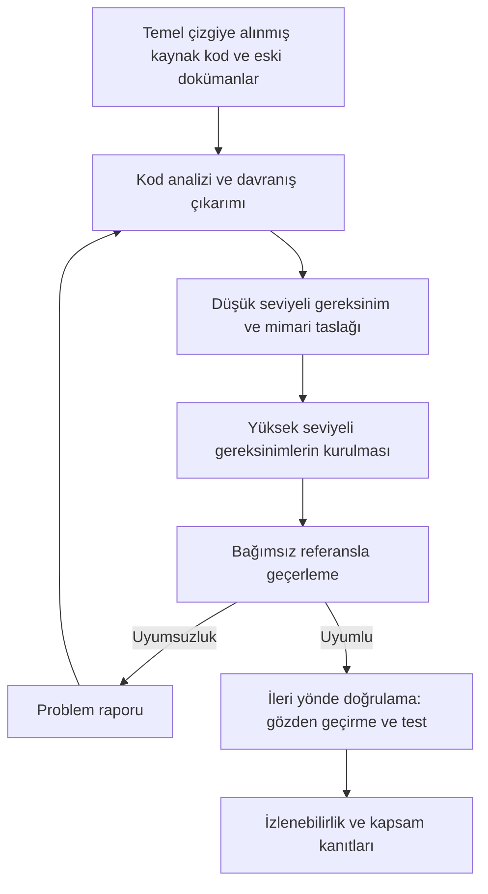

# 25. Tersine Mühendislik

Tersine mühendislik (reverse engineering), mevcut koddan geriye doğru giderek eksik ya da
güncelliğini yitirmiş gereksinim ve tasarım verisini yeniden kurma çalışmasıdır. DO-178C
hedefleri (objective) bu yolda da aynen geçerlidir; bu bölüm yaklaşımın ne zaman makul olduğunu, nasıl
planlanacağını ve koddan çıkarılan gereksinimlerin koddan bağımsız bir referansla nasıl
geçerleneceğini anlatır.

## Neden yapılır?

Olağan akışta, yani ileri yönde geliştirmede (forward engineering), her veri bir üst
soyutlama düzeyindeki veriden üretilir: sistem gereksinimlerinden yüksek seviyeli
gereksinimler (high-level requirements), onlardan tasarım ve düşük seviyeli gereksinimler
(low-level requirements), onlardan kod. Tersine mühendislikte elde zincirin yalnızca alt
halkası vardır ve üst halkalar ondan geriye doğru kurulur. DO-178C'nin sözlüğü terimi
geniş tutar: eldeki yazılım verisinden daha üst düzeydeki verinin üretilmesi. Düşük
seviyeli gereksinimlerden yüksek seviyeli gereksinim kurmak da, nesne kodundan kaynak kod
çıkarmak da bu tanıma girer. Bu bölüm uygulamada en sık karşılaşılan hâli, kaynak koddan
gereksinim ve tasarımın kurulmasını ele alır. Buna başvurulan tipik durumlar şunlardır:

- **Kayıp ya da eskimiş veri.** Uzun ömürlü bir üründe gereksinim ve tasarım dokümanları
  kaybolmuş, ekip değişmiş ya da yıllar içinde yapılan düzeltmeler dokümanlara
  işlenmediği için veri kodla uyumsuz hâle gelmiştir.
- **Başka bir süreçle geliştirilmiş yazılım.** Askerî, endüstriyel ya da ticari hazır
  yazılım (commercial off-the-shelf, COTS) kökenli bir bileşen, DO-178C'nin beklediği
  yaşam döngüsü verisi olmadan gelir.
- **Daha yüksek yazılım seviyesine taşıma.** Eski projede üretilmemiş ya da yeni yazılım
  seviyesinin (software level) gerektirdiği ayrıntıda olmayan veri tamamlanmak
  zorundadır.

Üçü de önceden geliştirilmiş yazılımın (previously developed software, PDS) yeniden
kullanımının özel hâlleridir. [24. Yazılım Yeniden Kullanımı](./24-yazilim-yeniden-kullanimi.md)
bölümünde anlatılan boşluk analizi (gap analysis) hangi verinin eksik olduğunu gösterir;
tersine mühendislik bu boşluğu kapatmanın yollarından yalnızca biridir. Bileşeni yeniden
geliştirmek, onu koruyucu bir mimariyle çevrelemek ya da ürün servis geçmişi (product
service history) kredisi talep etmek
([Ek D: Yazılım Servis Geçmişi Soruları](../06-ekler/04-ek-d-servis-gecmisi-sorulari.md))
aynı analizde birlikte tartılır.

## Ne zaman makul, ne zaman değil?

Tersine mühendislikte en büyük risk, kodun ne yaptığına bakıp bunun yapılması gereken şey
olduğunu varsaymaktır. Bu yüzden çıkarılan bilgi hemen doğru kabul edilmez. Riskin
büyüklüğü, elde koddan bağımsız ne kadar bilgi bulunduğuna bağlıdır:

| Eldeki veri | Yeniden kurulacak veri | Ana risk | Değerlendirme |
|---|---|---|---|
| Gereksinim ve tasarım var ama kodla uyumsuz | Güncel gereksinim, tasarım ve iz verisi (trace data) | Her farkta "kod doğrudur" diye karar vermek | Genellikle makul; her fark tek tek problem raporuyla (problem report) çözülür |
| Kaynak kod ve sistem gereksinimleri var; yazılım gereksinimi ve tasarım yok | Yüksek ve düşük seviyeli gereksinimler, mimari, iz verisi | Gereksinimin kodun yeniden anlatımına dönüşmesi; tasarım gerekçelerinin kaybı | Makul; yazılımın niyetini bilen uzman ve bağımsız referans şarttır |
| Kaynak kod var; niyeti anlatan belge de bilen kişi de yok | Sistem düzeyindeki niyet dahil bütün zincir | Geçerlemenin (validation) dayanacağı referans yok; koddaki hata gereksinime taşınır | Önce sistem düzeyinde niyet kurulur; kurulamıyorsa yeniden geliştirme daha sağlamdır |
| Yalnızca çalıştırılabilir nesne kodu (executable object code) var | Kaynak kod dahil her şey | Kod gözden geçirmesi ve kaynak düzeyinde kapsam analizi için güvenilir bir kaynak yoktur | Tanım gereği bu da tersine mühendisliktir, ama uygulamada savunulması en güç hâldir; yeniden geliştirme ya da 24. bölümdeki COTS yaklaşımları düşünülür |
| Kod bu projede, gereksinim beklenmeden yazılmış | Geriye dönük "tamamlanan" gereksinim ve tasarım | Planlara uyulmadığının üstünün örtülmesi | Bilgi kurtarma değil, süreç sapmasıdır; otoritenin de böyle değerlendirmesi beklenir |

Yazılım seviyesi yükseldikçe hem iş hem risk büyür. Seviye A ve B'de bağımsızlık aranan
doğrulama (verification) hedefleri vardır; kodu çözümleyip gereksinimi yazan kişi o
gereksinimin gözden geçirmesini ve testini de üstlenirse hem bağımsızlık hem de hatayı
yakalama şansı kaybolur. Kod, karar kapsama (decision coverage) ya da değiştirilmiş
koşul/karar kapsama (modified condition/decision coverage, MC/DC) gözetilmeden yazılmış
olduğundan, bu ölçütleri gereksinim tabanlı testle (requirements-based testing) sağlamak beklenenden zor çıkabilir ve
kodda değişiklik gerektirebilir. Seviye D'de yapısal kapsam hedefi bulunmadığı için aynı
çalışma çok daha dar kalır. Yaklaşımın en iyi sonuç verdiği yer, küçük, kararlı ve işlevi
iyi bilinen bileşenlerdir; büyük, karmaşık ve yorum satırı bile olmayan bir kod tabanında
niyeti güvenle kurmak çoğu zaman yeniden yazmaktan pahalıdır.

## Dayanak dokümanlar

Tersine mühendisliği ayrıntılı biçimde düzenleyen bağlayıcı bir belge yoktur. DO-178C'de
terim yalnızca sözlükte ve geliştirme temel çizgisinin (baseline) yükseltilmesini anlatan
maddede (12.1.4) geçer. Beklentiler üç kaynaktan izlenebilir:

| Doküman | Statüsü | Bu konuda söylediği |
|---|---|---|
| DO-178C'nin önceden geliştirilmiş yazılıma ilişkin hükümleri, özellikle madde 12.1.4 (AC 20-115D ve AMC 20-115D ile tanınır) | Kabul edilebilir uyum yöntemi | Bir geliştirme temel çizgisi yükseltilirken eksik ya da yetersiz yaşam döngüsü verisinin tersine mühendislikle yeniden üretilebileceğini kabul eder; veriyi üretmenin tek başına yetmeyebileceğini, doğrulama hedefleri için ek faaliyet gerekebileceğini de belirtir. Amaç yine aynı hedefleri karşılamaktır |
| CAST-18, "Reverse Engineering in Certification Projects" (2003) | Sertifikasyon otoritelerinin yazılım uzmanlarından oluşan ekibin (Certification Authorities Software Team, CAST) tutum belgesi; resmî politika değildir, DO-178B döneminden kalma tarihî bir başvuru kaynağıdır | Otoritelerin kaygılarını sıralar: yetersiz planlama, yaklaşımın maliyeti kısmak ya da aksayan projeyi kurtarmak için seçilmesi, yazılımın niyetini bilen uzmana erişilememesi, anlaşılması güç kod, soyutlama ve izlenebilirlik (traceability) güçlüğü, geç kalan otorite irtibatı |
| DOT/FAA/TC-15/27, "Reverse Engineering for Software and Digital Systems" (2016) | FAA'nın desteklediği araştırma raporu; FAA politikası değildir, DO-178B ve DO-254 esas alınarak yazılmıştır | Tersine mühendisliğin ne zaman kabul edilebilir olduğuna dair bir çerçeve önerir ve bunu biri yazılım, biri donanım üzerinde iki vaka çalışmasıyla sınar: veri akışının ve verinin ne zaman konfigürasyon kontrolüne alınacağının plan ve standartlarda açıkça anlatılması; alan uzmanlarının (subject matter expert) gerçekleştirilmiş davranışı amaçlanan kullanım açısından değerlendirmesi ve alan bilgisinin gereksinim ile tasarıma işlenmesi |

Üç kaynağın ortak noktası, tersine mühendisliğin ayrı bir uyum yolu olmadığıdır: veri
hangi sırayla üretilirse üretilsin, karşılanması gereken hedefler ileri yönde
geliştirilmiş bir projedekilerle aynıdır. Ayrıntılı bir rehber bulunmadığı için kabul
koşulları proje bazında, sertifikasyon otoritesiyle birlikte belirlenir.

## Süreç adım adım

Tersine mühendislik genellikle şu akışla işler:


```mermaid
flowchart TD
    A["Temel çizgiye alınmış kaynak kod ve eski dokümanlar"] --> B["Kod analizi ve davranış çıkarımı"]
    B --> C["Düşük seviyeli gereksinim ve mimari taslağı"]
    C --> D["Yüksek seviyeli gereksinimlerin kurulması"]
    D --> E["Bağımsız referansla geçerleme"]
    E -- "Uyumsuzluk" --> F["Problem raporu"]
    F --> B
    E -- "Uyumlu" --> G["İleri yönde doğrulama: gözden geçirme ve test"]
    G --> H["İzlenebilirlik ve kapsam kanıtları"]
```

1. **Girdi dondurulur.** Kaynak kod ve eldeki bütün eski veri tanımlanıp konfigürasyon
   kontrolüne alınır; analiz bu tanımlı sürüm üzerinde yapılır.
2. **Kod çözümlenir.** Çağrı yapısı, veri ve kontrol akışı, arayüzler ve durumlar
   çıkarılır. Her çıkarım, dayandığı kod parçasıyla birlikte kaydedilir; bu kayıt ileride
   iz verisine dönüşür.
3. **Tasarım ve düşük seviyeli gereksinimler yazılır.** Bunlar kodun satır satır yeniden
   anlatımı olamaz; kodun *neyi* sağladığını, kodu görmeyen birinin aynı işlevi
   gerçekleştirebileceği biçimde söylemelidir. Koddaki savunmacı denetimler (aralık
   denetimi, geçersiz veri kolu) de gereksinim olarak yazılır ki gürbüzlük (robustness)
   testlerinin konusu olsun.
4. **Yüksek seviyeli gereksinimler kurulur** ve sistem gereksinimlerine izlenir. Burada
   beklenen, düşük seviyeli gereksinimlerin özeti değil, yazılımın dışarıdan gözlenen
   davranışıdır.
5. **Çıkarılan gereksinimler geçerlenir.** Koddan bağımsız referansla karşılaştırılır;
   her fark problem raporuna dönüşür ve akış ilgili adıma geri döner.
6. **Doğrulama ileri yönde yapılır.** Gözden geçirme, analiz ve testler geçerlenmiş
   gereksinimleri esas alır; izlenebilirlik ve kapsam kanıtları bu adımda üretilir.

Dikkat edilmesi gereken nokta, akışın sonunda ok yönünün tekrar "ileri" dönmesidir:
gereksinimler bir kez kurulduktan sonra doğrulama, sanki proje baştan ileri yönde
geliştirilmiş gibi gereksinimlerden koda doğru yapılır.

## Ele alınması gereken konular

Tersine mühendislik bir sertifikasyon projesinde "kodu okuduk,
dokümanları yazdık" diye özetlenebilecek gayriresmî bir faaliyet olarak kalamaz.
Otorite gözünde bu yaklaşım, normal geliştirme akışının tersine işletilmesidir ve
tam da bu yüzden dört konunun baştan netleştirilmesini bekler: otoritenin
bilgilendirilmesi, sürecin planlarda tanımlanması, kaynak malzemenin konfigürasyon
yönetimi (configuration management) altına alınması ve çıkarılan gereksinimlerin
geçerlenmesi.

### Otorite beklentileri

Sertifikasyon otoriteleri tersine mühendisliği yasaklamaz; ancak "ucuz bir kestirme"
olarak kullanılmasına da izin vermez. Deneyim, şu beklentilerin hemen her projede
gündeme geldiğini gösterir:

- Yaklaşım, katılım aşaması (Stage of Involvement, SOI) denetimlerinden önce,
  tercihen planlama aşamasında otoriteyle açıkça konuşulmalıdır
  ([12. Sertifikasyon İrtibatı](../03-do178c-ile-gelistirme/12-sertifikasyon-irtibati.md)).
  SOI-1'de sürpriz olarak ortaya çıkan bir tersine mühendislik stratejisi neredeyse her
  zaman bulgu üretir; kapsamı ancak sonraki denetimlerde anlaşılan bir strateji ise
  onayın kendisini riske atar.
- Sonuçta üretilen yaşam döngüsü verileri, ileri yönde geliştirilmiş bir projeninkiyle
  **aynı kalitede** olmalıdır: yüksek ve düşük seviyeli gereksinimler, yazılım
  mimarisi (software architecture), izlenebilirlik ve doğrulama kanıtları eksiksiz
  beklenir.
- "Kod böyle yazılmış, demek ki gereksinim budur" mantığı kabul görmez. Kodun mevcut
  davranışı ile sistemin **istenen** davranışı ayrı ayrı ele alınmalı; farklar
  problem raporuna dönüştürülmelidir.
- Kaynak kodda bulunan ama hiçbir gereksinime bağlanamayan her yapı için karar
  verilmelidir: eksik bir gereksinim mi, devre dışı bırakılmış kod (deactivated code)
  mu, yoksa ölü kodu (dead code) da içeren gereksiz kod (extraneous code) mu? Tersine
  mühendislik bu sınıflandırmadan muafiyet sağlamaz; kararın sonuçları aşağıda
  "İleri yönde doğrulama" başlığında ele alınır.

### Sürecin planlarda tanımlanması

Tersine mühendislik yapılacaksa bu, yazılım planlarında adıyla anılmalı ve süreç
adım adım tanımlanmalıdır. Yazılım sertifikasyon planı (Plan for Software Aspects of
Certification, PSAC) yaklaşımı ve kapsamını açıkça söyler; yazılım geliştirme planı
(Software Development Plan, SDP) verinin hangi sırayla ve hangi geçiş kriterleriyle
yeniden kurulacağını, yazılım doğrulama planı (Software Verification Plan, SVP) çıkarılan
verinin nasıl gözden geçirilip doğrulanacağını tanımlar
([5. Yazılım Planlama](../03-do178c-ile-gelistirme/05-yazilim-planlama.md)). DO-178C'nin
bu konuda açıkça istediği PSAC tarafıdır: önceden geliştirilmiş yazılım kullanma niyeti ve
temel çizgi yükseltilirken izlenecek uyum stratejisi bu planda belirtilir. Asgari olarak
planlarda şunlar yer almalıdır:

| Plan içeriği | Cevaplaması gereken soru |
|---|---|
| Kapsam | Hangi bileşenler tersine mühendisliğe tabi, hangileri yeniden yazılacak? |
| Girdi verisi | Hangi kaynak malzeme (kod, eski dokümanlar, test kayıtları) kullanılacak? |
| Üretilecek veri | Hangi yaşam döngüsü verileri, hangi sırayla yeniden kurulacak? |
| Geçiş kriterleri | Bir adım ne zaman "tamamlandı" sayılır, geri dönüşler nasıl yönetilir, hangi veri ne zaman konfigürasyon kontrolüne girer? |
| Roller | Yazılımın niyetini bilen alan uzmanları kimlerdir, hangi adımda ne yaparlar? |
| Doğrulama ve geçerleme | Çıkarılan gereksinimler kime, hangi yöntemle onaylatılacak? |
| Araçlar | Statik analiz veya kod anlama araçları kullanılacaksa araç kalifikasyonu (tool qualification) gerekiyor mu? |

Son satırın cevabı çoğu zaman "hayır"dır: kod anlama aracının çıktısı (çağrı çizgesi,
veri akış özeti) gözden geçirmeyle ayrıca doğrulanıyorsa kalifikasyon gerekmez. Aracın
çıktısına doğrulanmadan güvenilecekse durum değişir; ölçütler
[13. DO-330 ve Yazılım Aracı Kalifikasyonu](../04-arac-kalifikasyonu-ve-ekler/13-do330-arac-kalifikasyonu.md)
bölümündedir. Planlama denetimine hazırlanırken [SW SOI-1](../kaynaklar/soi-1.md)
kontrol listesi, tersine mühendislik kapsamındaki bileşenler için de aynen uygulanır.

### Kaynak malzemenin konfigürasyon kontrolü

Tersine mühendisliğin girdisi olan kod ve eski dokümanlar çoğu zaman dağınıktır:
farklı sürümler, yerel kopyalar, hangi çalıştırılabilir nesne koduna karşılık geldiği
belirsiz kaynak ağaçları. Bu malzeme konfigürasyon yönetimi altına alınmadan analiz
başlarsa, üç ay sonra "hangi kodu tersine mühendislikten geçirdik?" sorusuna cevap
verilemez.

- Analize başlamadan önce kaynak kodun **tek ve tanımlı bir temel çizgisi**
  oluşturulmalı; sahadaki çalıştırılabilir nesne kodu ile bu kaynağın eşleştiği, örneğin
  kayıtlı derleme ortamında yeniden üretip karşılaştırarak gösterilebilmelidir. Eşleşme
  gösterilemiyorsa sahadaki ürünün geçmişi bu kaynak için kanıt değeri taşımaz.
- Eski dokümanlar, test kayıtları ve ürün servis geçmişi de aynı temel çizgiye referansla
  saklanmalıdır; bunlar "güvenilir gerçek" değil, **girdi verisi** statüsündedir.
- Önceki projeden devralınan açık problem raporları da girdidir. DO-178C, önceden
  geliştirilmiş yazılımın çözülmemiş problem raporlarının etkisinin değerlendirilmesini ve
  önceki uygulamanın ürünü ile verisinden yeni uygulamaya izlenebilirlik kurulmasını ister.
- Analiz sırasında kodda düzeltme ihtiyacı doğarsa değişiklik, normal problem raporu
  ve değişiklik kontrol mekanizmasından geçmelidir; "nasılsa her şeyi yeniden
  yazıyoruz" rahatlığıyla kontrolsüz düzenleme yapılmamalıdır.

Temel çizgi, değişiklik kontrolü ve problem raporlamanın işleyişi
[10. Yazılım Konfigürasyon Yönetimi](../03-do178c-ile-gelistirme/10-yazilim-konfigurasyon-yonetimi.md)
bölümünde anlatılır; tersine mühendislikte fark, bu mekanizmanın ilk çıkarım yapılmadan
önce kurulmuş olması gerektiğidir.

### Çıkarılan gereksinimlerin geçerlenmesi

Koddan çıkarılan bir gereksinim, tanımı gereği koddan türetilmiştir; bu yüzden kodla
uyumu neredeyse otomatiktir ama **doğruluğu** hakkında hiçbir şey söylemez. Kodun
içindeki bir hata, aynı hatayı tarif eden bir gereksinime dönüşür ve doğrulama bu
döngüyü kırmadan yalnızca kendi kendini onaylar. Döngüyü kırmak için:

- Çıkarılan yüksek seviyeli gereksinimler, koddan **bağımsız bir referansla**
  geçerlenmelidir: sistem gereksinimleri, sistem emniyet değerlendirme sürecinin (system
  safety assessment process) çıktıları, arayüz kontrol dokümanları (interface control
  document), alan uzmanlarının bilgisi ve varsa saha deneyimi.
- Gereksinim gözden geçirmelerine kodu yazan veya analiz eden kişiden **başka**,
  sistemin işlevini bilen bir uzman katılmalıdır; aksi hâlde gözden geçirme, analiz
  notlarının ikinci kez okunmasından ibaret kalır.
- Sistem gereksinimlerine bağlanamayan çıkarımlar, türetilmiş gereksinim (derived
  requirement) olarak işaretlenip sistem emniyet değerlendirme süreci dahil sistem
  süreçlerine geri beslenmelidir; tersine mühendislik bu yükümlülüğü ortadan kaldırmaz
  (kavram için bkz.
  [6. Yazılım Gereksinimleri](../03-do178c-ile-gelistirme/06-yazilim-gereksinimleri.md)).
- Kod davranışı ile bağımsız referans çeliştiğinde varsayılan kabul, **kodun hatalı
  olabileceğidir**; fark bir problem raporuyla kayda geçirilir ve mühendislik kararı
  gerekçesiyle birlikte belgelenir.

## Bir örnek: koddaki hatanın gereksinime taşınması

Aşağıdaki kurgusal işlev, radyo irtifası bir eşiğe indiğinde alçak irtifa uyarısını
etkinleştiriyor:

```c
#define UYARI_ESIGI_FT  (100)

bool irtifa_uyarisi_etkin(int32_t radyo_irtifa_ft, bool irtifa_gecerli)
{
    bool etkin = false;

    if (irtifa_gecerli && (radyo_irtifa_ft < UYARI_ESIGI_FT))
    {
        etkin = true;
    }

    return etkin;
}
```

Kodu çözümleyen mühendis buradan iki ifade çıkarır. Aynı işlev için sistem gereksinimleri
ise başka bir şey söylemektedir:

| Koddan çıkarılan (kodu tekrar eden) ifade | Bağımsız referanstaki niyet | Sonuç |
|---|---|---|
| "Radyo irtifası geçerli ve 100 ft'ten küçükse uyarı etkinleştirilir." | Uyarı, irtifa 100 ft'e indiğinde ve altında verilir | Kod sınır değerde hatalıdır; problem raporu açılır, kod düzeltilir ya da sistem gereksinimi gerekçesiyle güncellenir |
| "Radyo irtifası geçerli değilse uyarı etkinleştirilmez." | İrtifa verisi geçersizken uyarının kullanılamadığı mürettebata bildirilir | İşlev kodda hiç yoktur; problem raporu açılır, eksik gereksinim ve kod eklenir |

İlk satır yanlış gerçekleştirilmiş bir işlevi, ikinci satır hiç gerçekleştirilmemiş bir
işlevi gösterir. İkincisi daha sinsidir: kod ne kadar dikkatle okunursa okunsun, orada
olmayan bir davranış koddan çıkarılamaz; eksikliği yalnızca bağımsız referans gösterir.

Geçerleme atlanıp testler soldaki ifadelerden yazılsaydı üç test durumu yeterdi: geçerli
99 ft, geçerli 100 ft ve geçersiz 99 ft. Üçü de geçer; üstelik bu üç durum, tek karardaki
iki koşul için MC/DC'yi de sağlar. Elde eksiksiz izlenebilirlik, geçen testler ve tam
yapısal kapsam olur; yazılım ise iki noktada sistemin istediğini yapmıyordur. Yapısal
kapsam, kodda olanın çalıştırıldığını gösterir; olması gerekenin kodda bulunduğunu
göstermez.

## İleri yönde doğrulama

Gereksinimler geçerlendikten sonra gözden geçirme, analiz ve testler ileri yönde
geliştirilmiş bir projedekilerle aynıdır
([9. Yazılım Doğrulama](../03-do178c-ile-gelistirme/09-yazilim-dogrulama.md)).
Tersine mühendisliğe özgü olan, şu üç kuraldır:

- **Testler koddan değil, geçerlenmiş gereksinimden yazılır.** Beklenen sonucu kodu
  okuyarak ya da çalıştırarak belirleyen test, yukarıdaki örnekteki gibi kodun kendisiyle
  tutarlı olduğunu kanıtlar. Sınır değerler ve gürbüzlük durumları gereksinimden seçilir.
  Testleri, kodu çözümleyip gereksinimi yazan kişiden başka birinin hazırlaması döngüyü
  kırmanın en ucuz yoludur.
- **Eski testler de girdi verisidir.** Eldeki test prosedürleri yeniden kullanılabilir;
  ancak her biri yeni gereksinimlere izlenmeli ve beklenen sonuçları gözden
  geçirilmelidir. İzlenemeyen test ya eksik bir gereksinime ya da gereksiz bir teste
  işaret eder.
- **Düşük seviyeli gereksinim sözde kod olamaz.** Gereksinim koda fazla yakınsa ondan
  türetilen test yalnızca gerçekleştirimi çalıştırır; yanlış, eksik ya da istenmeyen
  işlevi yakalama gücü kalmaz. Gözden geçirme kontrol listesine "bu gereksinim, kodu
  görmeden yazılabilir miydi?" sorusu eklenmelidir.

Yapısal kapsam analizi (structural coverage analysis) burada ayrı bir dikkat ister. İleri
yönde geliştirmede gereksinime izlenemeyen kod, kapsam boşluğu olarak kendini gösterir.
Tersine mühendislikte ise her kod parçası için bir ifade yazıldığından, gereksiz kod da
"gereksinimi olan" koda dönüşüp gözden kaçabilir. Sınıflandırma bu yüzden kapsam
analizine bırakılmaz; geçerleme sırasında, sistem gereksinimlerine ya da gerekçeli bir
türetilmiş gereksinime bağlanamayan her yapı için yapılır:

| Bulgu | Karar | Sonuç |
|---|---|---|
| Kod gerekli bir davranışı gerçekliyor ama karşılığı olan gereksinim yok | Eksik gereksinim | Gereksinim yazılır, bağımsız referansla geçerlenir, testi eklenir |
| Kod bir gereksinime izlenebiliyor ama tasarım gereği bu konfigürasyonda çalışmıyor (ör. başka bir uçak tipine ait seçenek) | Devre dışı bırakılmış kod | Planlarda beyan edilir; istem dışı etkinleşmeyi (inadvertent enabling) önleyen mekanizma doğrulanır. Kod başka bir onaylı konfigürasyonda çalışıyorsa kapsamı o konfigürasyon kurularak yapılan testlerle sağlanır |
| Kod hiçbir gereksinime izlenemiyor; ölü kod bunun hiç çalıştırılamayan özel hâlidir | Gereksiz kod | Kaldırılır |

Kapsam analizinde yine de boşluk çıkarsa dördüncü olasılık, gereksinim tabanlı testlerin
eksik olmasıdır. Tanımlar ve her kararın gerektirdiği kanıt
[17. Kapsanmayan Kodlar: Ölü, Gereksiz ve Devre Dışı Bırakılmış Kodlar](./17-kapsanmayan-kodlar.md)
bölümündedir. Kod kaldırmak, sahadaki sürümden farklı bir kod üretmek demektir: değişiklik
problem raporu ve değişiklik etki analizinden (change impact analysis) geçer; ürün servis
geçmişine dayanan bir argüman varsa ona etkisi de ayrıca değerlendirilir.

## Bu bölümden akılda kalması gerekenler

- Tersine mühendislik bilgi kurtarma işidir, kestirme yol değildir: DO-178C hedefleri
  aynen geçerlidir ve üretilen veri ileri yönde geliştirilmiş bir projeninkiyle aynı
  kalitede olmalıdır.
- Yaklaşımın makul olup olmadığını, elde koddan bağımsız ne kadar bilgi bulunduğu
  belirler; niyeti anlatan bir referans ya da alan uzmanı yoksa çıkarılan gereksinimi
  geçerleyecek dayanak kalmaz.
- Yaklaşım planlarda açıkça tanımlanmalı ve otoriteyle erken, tercihen SOI-1 öncesinde
  konuşulmalıdır.
- Kaynak kod ve eski dokümanlar analiz başlamadan konfigürasyon yönetimi altına
  alınmalı; girdi malzemesi "güvenilir gerçek" değil veri olarak ele alınmalıdır.
- Koddan çıkarılan gereksinimler koddan bağımsız bir referansla geçerlenmelidir;
  aksi hâlde koddaki hata gereksinime taşınır ve doğrulama kendi kendini onaylar.
- Testler koddan değil geçerlenmiş gereksinimden yazılır; düşük seviyeli gereksinim
  kodun yeniden anlatımı olamaz.
- Gereksinime bağlanamayan her kod için karar verilir: eksik gereksinim yazılır, devre
  dışı bırakılmış kodun mekanizması doğrulanır, gereksiz kod (ölü kod dahil) kaldırılır.
