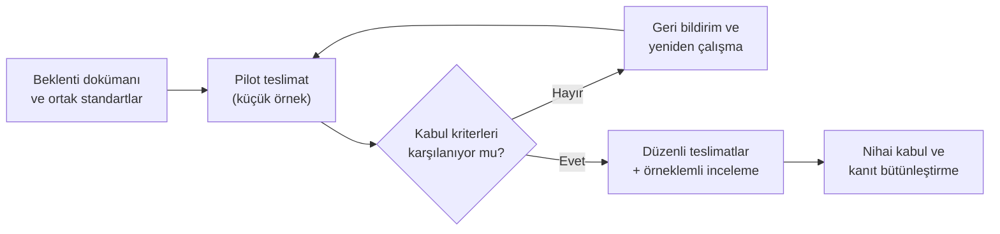

# 26. Yazılım Yaşam Döngüsü Faaliyetlerinde Dış Kaynak Kullanımı

Dış kaynak kullanımı (outsourcing), bazı yazılım faaliyetlerinin tedarikçi (supplier)
tarafından yürütülmesi anlamına gelir. Ancak sorumluluk tamamen devredilmez; ana yüklenici kanıtın
bütünlüğünden sorumlu kalır.

Bu bölüm, iş bölümü, izlenebilirlik (traceability) ve tedarikçi çıktılarının
doğrulanması için kısa bir çerçeve sunar.

## Neden dikkat gerekir?

Tedarikçi iyi iş çıkarsa bile ana yüklenici, bu işin sertifikasyon açısından yeterli
olduğunu göstermek zorundadır. Yani dış kaynak, sorumluluğu azaltmaz; sadece iş
dağıtımını değiştirir.

## Yönetilmesi gereken alanlar

- teslim edilecek iş ürünleri,
- kabul kriterleri,
- gözden geçirme sorumluluğu,
- değişiklik iletişimi,
- doğrulama kapsamı.

### Dış kaynak kullanımında dikkat noktaları

- Tedarikçi iş ürünü tam olarak tanımlanmalı.
- Gözden geçirme ve kabul kriterleri önceden belirlenmeli.
- Nihai sorumluluk ana yüklenicide kalmalı.

## Dış kaynak kullanımının nedenleri

Aviyonik projelerinde dış kaynak kararı genellikle üç ana gerekçeye
dayanır: maliyet, kapasite ve uzmanlık. Bu gerekçelerin her biri kendi başına makuldür;
sorun, çoğu zaman gerekçenin arkasındaki varsayımların sorgulanmadan kabul edilmesidir.

**Maliyet.** En sık dile getirilen gerekçe, saat ücreti daha düşük bir tedarikçiyle
toplam geliştirme maliyetini düşürmektir. Ancak emniyet-kritik yazılımda maliyetin
büyük kısmı kod yazmaktan değil; gereksinim (requirement) geliştirme, doğrulama, gözden
geçirme ve sertifikasyon kanıtı üretiminden gelir. Saat ücreti üzerinden yapılan
karşılaştırma, bu faaliyetlerin tedarikçi tarafında ne kadar verimli yürütüleceğini
hesaba katmazsa yanıltıcı olur.

**Kapasite.** Proje takvimi sıkıştığında veya aynı anda birden fazla program
yürütüldüğünde, iç ekip yetmez ve iş dışarıya taşınır. Bu gerekçe kısa vadede geçerli
olsa da, tedarikçiye aktarılan işin tanımlanması, aktarılması ve geri alındığında
bütünleştirilmesi de kapasite tüketir. "Dışarı verdik, yükümüz azaldı" varsayımı,
koordinasyon yükü ölçülmeden doğrulanamaz.

**Uzmanlık.** Bazı alanlarda — örneğin belirli bir gerçek zamanlı işletim sistemi
(real-time operating system, RTOS) entegrasyonu, araç kalifikasyonu (tool
qualification) veya model tabanlı geliştirme (model-based development) —
tedarikçinin birikimi iç ekipten fazla olabilir. Bu, dış kaynak
gerekçelerinin en sağlamıdır; ancak uzmanlığın gerçekten var olduğu, referans proje ve
sertifikasyon geçmişiyle doğrulanmalıdır.

Bu gerekçelerin gerçekleşmesini engelleyen **gizli maliyetler** (hidden costs) çoğu
zaman sözleşme aşamasında görünmez:

| Gizli maliyet | Nerede ortaya çıkar? |
|---|---|
| Beklenti aktarımı | Standartların, şablonların ve süreçlerin tedarikçiye öğretilmesi |
| Gözden geçirme yükü | Tedarikçi çıktılarının ana yüklenici tarafından incelenmesi |
| Yeniden çalışma | Kabul kriterlerini karşılamayan iş ürünlerinin düzeltme döngüleri |
| Koordinasyon | Toplantılar, soru-cevap trafiği, değişiklik bildirimleri |
| Bütünleştirme | Tedarikçi çıktısının ana konfigürasyon yönetimi (configuration management) ve izlenebilirlik zincirine alınması |
| Denetim | Tedarikçi süreçlerinin yerinde veya uzaktan denetlenmesi |

Deneyim şunu gösterir: Dış kaynak kararının başarısı, saat ücreti farkından çok, bu
gizli maliyetlerin baştan öngörülüp bütçelenmesine bağlıdır. Gizli maliyetler
bütçelenmediğinde, ya proje takvimi kayar ya da — daha kötüsü — gözden geçirme ve kabul
faaliyetleri kısaltılarak kanıt kalitesinden ödün verilir.

## Zorluklar ve riskler

Dış kaynak kullanımının riskleri, işin teknik zorluğundan çok bilgi akışının
kesintiye uğramasından kaynaklanır. Aşağıdaki dört risk alanı, uygulamada en sık
karşılaşılanlardır.

**İletişim ve saat dilimi farkları.** Tedarikçi farklı bir ülkede veya saat diliminde
çalışıyorsa, basit bir sorunun yanıtı bir iş gününü bulabilir. Gereksinim
belirsizliği gibi hızlı netleştirme gerektiren konularda bu gecikme
birikir: tedarikçi beklememek için varsayım yapar, varsayım yanlış çıkar ve yeniden
çalışma doğar. Dil farkı da ayrı bir katmandır; teknik terimlerin iki tarafta farklı
anlaşılması, gözden geçirmede geç fark edilen tutarsızlıklara yol açar.

**Alan bilgisi eksikliği.** Genel yazılım geliştirme becerisi ile aviyonik alan
bilgisi aynı şey değildir. ARINC 429 etiket (label) yapısını, yazılım bölümlemesi
(software partitioning) kısıtlarını veya donanım-yazılım arayüzünün zamanlama davranışını bilmeyen bir ekip,
sözdizimsel olarak doğru ama alan açısından hatalı iş üretebilir. Bu tür hatalar
birim seviyesindeki doğrulamadan kaçar ve genellikle entegrasyon testinde — yani
düzeltmenin en pahalı olduğu yerde — ortaya çıkar.

**Kalite görünürlüğünün azalması.** İç ekipte kalite sorunları gündelik temasla erken
fark edilir: kod gözden geçirmeleri, koridor konuşmaları, ekip toplantıları. Tedarikçi
tarafında bu doğal görünürlük yoktur; ana yüklenici yalnızca teslim edilen iş
ürünlerini görür. Sorunlar teslimata kadar gizli kalır ve teslimatta toplu hâlde
ortaya çıkar. Kalite güvencesi (quality assurance) faaliyetleri tedarikçi sahasını
kapsamıyorsa, süreç sapmaları hiç görülmeyebilir.

**Sertifikasyon beklentilerinin aktarılamaması.** En kritik risk budur. Tedarikçi
"çalışan yazılım" teslim etmeye odaklanırken, ana yüklenicinin asıl ihtiyacı
**kanıtlanabilir** yazılımdır: izlenebilirlik kayıtları, gözden geçirme tutanakları,
yapısal kapsam analizi (structural coverage analysis) sonuçları, konfigürasyon
yönetimi kayıtları. Sertifikasyon deneyimi olmayan bir tedarikçi bu
çıktıları ya hiç üretmez ya da biçimsel olarak üretir; içerik denetimi yapılana kadar
eksiklik fark edilmez. Katılım aşaması (Stage of Involvement, SOI) denetimlerinde
tedarikçi kaynaklı bulgular, ana yüklenicinin bulgusu olarak kaydedilir — otorite
açısından "tedarikçi yaptı" diye bir mazeret yoktur.

| Risk | Erken belirti | Görülmezse sonucu |
|---|---|---|
| İletişim gecikmesi | Soru-cevap süresinin uzaması, varsayım listelerinin şişmesi | Yanlış varsayıma dayalı yeniden çalışma |
| Alan bilgisi eksikliği | Gereksinim yorum sorularının azlığı (soru sormayan tedarikçi şüphe uyandırmalı) | Entegrasyonda geç ve pahalı hatalar |
| Görünürlük kaybı | Ara teslimat/ölçüm paylaşımının aksaması | Teslimatta toplu sürpriz |
| Beklenti aktarımı eksikliği | Kanıt paketlerinin biçimsel ama içeriksiz olması | SOI denetim bulguları, sertifikasyon gecikmesi |

## Önerilen önlemler

Yukarıdaki risklerin ortak özelliği, iş başladıktan sonra düzeltilmelerinin zor
olmasıdır. Bu nedenle önlemlerin ağırlık merkezi sözleşme öncesi ve proje başlangıcı
dönemidir.

**Erken ve yazılı beklenti aktarımı.** Sertifikasyon beklentileri sözlü anlatımla
aktarılamaz. Tedarikçiye, hangi iş ürünlerinin hangi içerikle teslim edileceğini,
hangi yazılım seviyesinin geçerli olduğunu ve hangi kanıtların bekleneceğini açıkça
tanımlayan yazılı bir beklenti dokümanı verilmelidir. Pratikte bu, sözleşmenin ekinde
yer alan bir iş tanımı ile ana yüklenicinin plan setinin (geliştirme, doğrulama,
konfigürasyon yönetimi, kalite güvencesi planları) ilgili kısımlarının tedarikçiye
uygulanabilir hâle getirilmesi anlamına gelir. "Nasıl olsa deneyimlidirler" varsayımı
en pahalı varsayımdır.

**Ortak standart seti.** Tedarikçinin kendi kodlama standardı, kendi gereksinim
şablonu ve kendi gözden geçirme kontrol listesiyle çalışması, teslim edilen ürünlerin
ana projeyle bütünleştirilmesini zorlaştırır. En baştan tek bir standart seti üzerinde
anlaşılmalıdır: gereksinim yazım standardı, tasarım ve kodlama standartları, doküman
şablonları, araç sürümleri ve isimlendirme kuralları. Ortak set, gözden geçirme
maliyetini düşürür ve "biz farklı yapıyoruz" tartışmalarını iş başlamadan bitirir.

**Aşamalı kabul denetimleri.** Tedarikçi çıktısını yalnızca proje sonunda tek seferde
kabul etmek, sorunların en geç ve en pahalı noktada bulunması demektir. Bunun yerine
kabul, küçük ve erken örneklerle başlamalıdır: ilk teslim edilen birkaç gereksinim,
ilk kod modülü, ilk test prosedürü ayrıntılı incelenir; beklentiyle uyum doğrulanır ve
sapmalar tedarikçiye erken geri bildirilir. Sonraki teslimatlarda örneklem
genişletilir veya daraltılır — tedarikçinin gösterdiği olgunlukla orantılı olarak.

**Tedarikçi süreçlerinin denetlenmesi.** Teslim edilen ürünü incelemek yeterli
değildir; ürünü üreten sürecin de plana uygun işlediği doğrulanmalıdır. Ana
yüklenicinin kalite güvencesi ekibi, tedarikçi sahasında (veya uzaktan) periyodik
denetimler yapmalı; gözden geçirme kayıtlarının gerçekten tutulduğunu, problem
raporlarının izlendiğini ve konfigürasyon yönetiminin işlediğini örnekleme yoluyla
kontrol etmelidir. Bu denetim hakkı sözleşmeye yazılmalıdır — sözleşmede yer almayan
denetim, ihtiyaç doğduğunda pazarlık konusu olur.

Son bir pratik not: Tedarikçiyle kurulan **tek temas noktası** yerine, teknik
sorular için doğrudan mühendis-mühendise bir kanal açmak, iletişim gecikmesi riskini
belirgin biçimde azaltır. Resmî yazışma kanalı sözleşme ve değişiklik iletişimi için
korunur; teknik netleştirme ise hızlı kanaldan yürür ve sonuçları kayıt altına alınır.

## İzlenebilirlik

Tedarikçiden gelen iş ürünleri, ana projenin izlenebilirlik zincirine dahil edilmelidir.
Kökeni belirsiz çıktı, sonraki kanıtı zayıflatır.

## Bu bölümden akılda kalması gerekenler

- Dış kaynak, sorumluluğu devretmez; ana yüklenici nihai kanıttan sorumludur.
- Saat ücreti karşılaştırması yanıltıcıdır; gözden geçirme, koordinasyon ve
  bütünleştirme gibi gizli maliyetler baştan bütçelenmelidir.
- En kritik risk, sertifikasyon beklentilerinin tedarikçiye aktarılamamasıdır:
  "çalışan yazılım" ile "kanıtlanabilir yazılım" aynı şey değildir.
- Beklentiler yazılı aktarılmalı, ortak bir standart seti üzerinde anlaşılmalı ve
  kabul kriterleri baştan tanımlanmalıdır.
- Kabul, proje sonuna bırakılmaz; küçük pilot teslimatlarla erken başlar ve aşamalı
  denetimlerle sürer.
- Ürünün yanında süreç de denetlenmelidir; denetim hakkı sözleşmeye yazılmalıdır.
