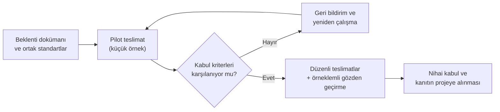

# 26. Yazılım Yaşam Döngüsü Faaliyetlerinde Dış Kaynak Kullanımı

Dış kaynak kullanımı (outsourcing), yazılım yaşam döngüsü faaliyetlerinin bir kısmının
tedarikçi (supplier) tarafından yürütülmesidir; iş devredilir, sertifikasyon sorumluluğu
devredilmez. Bu bölüm iş bölümünü, tedarikçi gözetiminin (supplier oversight) planlarda
nasıl tanımlandığını, iki kuruluş arasındaki sınırda sahipsiz kalmaya yatkın sertifikasyon
konularını ve tedarikçi verisinin projeye nasıl alındığını anlatır.

Önce roller ve terimler. Sertifikasyon otoritesi karşısında sorumlu taraf **başvuru
sahibidir** (applicant). Ticari zincirde işi dışarı veren kuruluş ise her zaman başvuru
sahibi değildir: bir ekipman üreticisi uçak üreticisine göre tedarikçi, kendi alt
yüklenicisine göre işi veren taraftır. Bu bölümde işi dışarı veren kuruluşa kısaca **ana
yüklenici** denecek; sorumluluk zinciri onun üzerinden başvuru sahibine uzanır.
**Gözetim**, tedarikçinin süreç ve çıktılarının proje boyunca izlenmesidir; **denetim**
(audit) bu gözetimin tekil, kayıtlı bir faaliyetidir. **İş ürünü** ile tedarikçinin
teslim ettiği yazılım yaşam döngüsü verisi (software life cycle data) ve kod kastedilir.

Kapsam dışı bir durum da not edilmeli: ticari hazır yazılımın (commercial off-the-shelf,
COTS), örneğin hazır bir işletim sisteminin ya da kütüphanenin satın alınması farklı bir
ilişkidir, çünkü ürün proje başlamadan önce vardır ve geliştirme süreci artık
yönlendirilemez. DO-178C'nin tanımı da aynı çizgiyi çeker: belirli bir uygulama için
sözleşmeyle geliştirilen yazılım COTS sayılmaz, bu bölümün konusudur. COTS ise
[24. Yazılım Yeniden Kullanımı](24-yazilim-yeniden-kullanimi.md),
[20. Gerçek Zamanlı İşletim Sistemleri](20-gercek-zamanli-isletim-sistemleri.md) ve
[Ek C: Gerçek Zamanlı İşletim Sistemi Seçiminde Sorulacak Sorular](../06-ekler/03-ek-c-rtos-secim-sorulari.md)
içinde ele alınır.

## Neden dikkat gerekir?

Tedarikçi iyi iş çıkarsa bile ana yüklenici, bu işin sertifikasyon açısından yeterli
olduğunu göstermek zorundadır. Yani dış kaynak, sorumluluğu azaltmaz; sadece iş
dağıtımını değiştirir.

DO-178C başvuru sahibinin iç örgütlenmesini ve tedarikçileriyle ticari ilişkisini kapsamı
dışında tutar; işi kimin yaptığıyla değil, hedeflerin (objective) karşılandığını gösteren
kanıtla ilgilenir. Sorumluluk konusunda ise açıktır: standart, yaşam döngüsü süreçlerinde
ya da bu süreçlerin çıktılarında payı olan her tedarikçi için de geçerlidir ve bütün
tedarikçilerin gözetiminden başvuru sahibi sorumludur. Tedarikçinin ürettiği veri bu
yüzden aynı hedeflere, aynı yazılım seviyesine (software level) ve aynı onaylı plan ve
standartlara tabidir. "Bu kısmı tedarikçi yaptı" cümlesi, kanıt zincirinde bir boşluğu
açıklamaz.

### Otorite beklentisi nerede yazılı?

Tedarikçi gözetimi için ayrı bir standart yoktur; beklenti DO-178C'nin içine dağılmıştır
ve standart bu konuyu önceki sürümüne göre daha açık hâle getirmiştir. Gözetimin nasıl
yapılacağı planlama sürecinde belirlenir ve planlara yazılır. Konfigürasyon yönetimi
(configuration management) faaliyetleri tedarikçide yürüyen işe de uygulanır; kalite
güvencesi (quality assurance) süreci tedarikçi süreç ve çıktılarının onaylı plan ve
standartlara uyduğuna güvence verir. Yazılım başarı özeti (Software Accomplishment
Summary, SAS) bu uyumun nasıl sağlandığını ayrı bir başlıkta anlatır.

FAA AC 20-115D ve EASA AMC 20-115D, DO-178C'yi kabul edilebilir uyum yöntemi olarak
tanıdığından bu beklentiler otorite karşısında da geçerlidir. FAA'nın yazılım onay
yönergesi Order 8110.49'da bir dönem tedarikçi gözetimine ayrılmış bir bölüm vardı; bu
bölüm sonradan yönergeden çıkarıldı ve güncel sürüm olan Order 8110.49A'da (2018) yer
almıyor. Eski proje dokümanlarında o bölüme atıf görülürse, güncel dayanağın DO-178C'nin
kendisi ve projenin otoriteyle mutabık kalınan planları olduğu bilinmelidir.

## Dış kaynak kullanımının nedenleri

Aviyonik projelerinde dış kaynak kararı genellikle üç ana gerekçeye
dayanır: maliyet, kapasite ve uzmanlık. Bu gerekçelerin her biri kendi başına makuldür;
sorun, çoğu zaman gerekçenin arkasındaki varsayımların sorgulanmadan kabul edilmesidir.

**Maliyet.** En sık dile getirilen gerekçe, saat ücreti daha düşük bir tedarikçiyle
toplam geliştirme maliyetini düşürmektir. Ancak emniyet-kritik yazılımda maliyetin
büyük kısmı kod yazmaktan değil; gereksinim (requirement) geliştirme, doğrulama, gözden
geçirme ve sertifikasyon kanıtı üretiminden gelir. Saat ücreti üzerinden yapılan
karşılaştırma, bu faaliyetlerin tedarikçi tarafında ne kadar verimli yürütüleceğini
hesaba katmazsa yanıltıcı olur.

**Kapasite.** Proje takvimi sıkıştığında veya aynı anda birden fazla program
yürütüldüğünde, iç ekip yetmez ve iş dışarıya taşınır. Bu gerekçe kısa vadede geçerli
olsa da, tedarikçiye aktarılan işin tanımlanması, aktarılması ve geri geldiğinde
projeye alınması da kapasite tüketir. "Dışarı verdik, yükümüz azaldı" varsayımı,
koordinasyon yükü ölçülmeden doğrulanamaz.

**Uzmanlık.** Bazı alanlarda — örneğin belirli bir gerçek zamanlı işletim sistemi
(real-time operating system, RTOS) entegrasyonu, araç kalifikasyonu (tool
qualification) veya model tabanlı geliştirme (model-based development) —
tedarikçinin birikimi iç ekipten fazla olabilir. Bu, dış kaynak
gerekçelerinin en sağlamıdır; ancak uzmanlığın gerçekten var olduğu, referans proje ve
sertifikasyon geçmişiyle doğrulanmalıdır.

Bu gerekçelerin gerçekleşmesini engelleyen **gizli maliyetler** (hidden costs) çoğu
zaman sözleşme aşamasında görünmez:

| Gizli maliyet | Nerede ortaya çıkar? |
|---|---|
| Beklenti aktarımı | Standartların, şablonların ve süreçlerin tedarikçiye öğretilmesi |
| Gözden geçirme yükü | Tedarikçi çıktılarının ana yüklenici tarafından gözden geçirilmesi |
| Yeniden çalışma | Kabul kriterlerini karşılamayan iş ürünlerinin düzeltme döngüleri |
| Koordinasyon | Toplantılar, soru-cevap trafiği, değişiklik bildirimleri |
| Projeye alma | Tedarikçi çıktısının ana konfigürasyon yönetimine ve izlenebilirlik (traceability) zincirine alınması |
| Gözetim | Tedarikçi süreçlerinin yerinde veya uzaktan denetlenmesi, bulguların takibi |

Deneyim şunu gösterir: Dış kaynak kararının başarısı, saat ücreti farkından çok, bu
gizli maliyetlerin baştan öngörülüp bütçelenmesine bağlıdır. Gizli maliyetler
bütçelenmediğinde, ya proje takvimi kayar ya da — daha kötüsü — gözden geçirme ve kabul
faaliyetleri kısaltılarak kanıt kalitesinden ödün verilir.

## İş bölümü: ne dışarı verilir, ne içeride kalır?

Her faaliyet dışarı verilmeye aynı ölçüde uygun değildir. Kaba ölçüt şudur: bir
faaliyetin girdisi ne kadar yazılı ve kararlıysa, çıktısı da ne kadar nesnel bir ölçütle
kabul edilebiliyorsa, o faaliyet o kadar rahat devredilir. Sistem bağlamı, hedef donanım
ya da otoriteyle mutabakat gerektiren kararlar ise içeride kalır. Aşağıdaki tablo tipik
bir iş bölümünü gösterir; satırlar kural değil, karar verirken sorulacak soruların
özetidir.

| Faaliyet | Dışarı verilmeye uygunluk | Tedarikçinin teslim ettiği | Ana yüklenicide kalan rol ve kanıt |
|---|---|---|---|
| Yüksek seviyeli gereksinimler (high-level requirements) | Düşük: sistem bilgisi ve sistem süreçleriyle sürekli geri bildirim ister | Gereksinim taslağı, sistem gereksinimlerine izlenebilirlik | Gereksinimlerin sahipliği; türetilmiş gereksinimlerin (derived requirement) sistem emniyet değerlendirme süreci dahil sistem süreçlerine iletilmesi; gözden geçirme kaydı |
| Tasarım ve düşük seviyeli gereksinimler | Orta: mimari kısıtlar ve arayüzler yazılı ve kararlıysa | Tasarım tanımı, düşük seviyeli gereksinimler, iz verisi (trace data) | Arayüz ve mimari uyumunun gözden geçirilmesi; yeni türetilmiş gereksinimlerin değerlendirilmesi |
| Kodlama | Yüksek: girdi gereksinimler olgun, kodlama standardı ortaksa | Kaynak kod, kod gözden geçirme kayıtları | Örneklemli kod gözden geçirmesi; derlemenin kendi ortamında yinelenmesi |
| Gereksinim tabanlı test (requirements-based testing) | Yüksek: gereksinimler kararlı, test ortamı iki tarafta eşdeğerse | Test durumları, test prosedürleri, sonuçlar, gereksinim–test izlenebilirliği | Testin gereksinimi gerçekten sınadığının örneklemli gözden geçirmesi; seçilmiş testlerin yeniden koşulması |
| Yapısal kapsam analizi (structural coverage analysis) | Orta: ölçüm devredilir, kapsanmayan kodun çözümlenmesi gereksinim ve tasarım bilgisi ister | Kapsam raporu, her boşluk için gerekçe önerisi | Her kapsam boşluğunun nedeninin ve çözümünün onaylanması |
| Donanım-yazılım entegrasyonu | Düşük: hedef donanıma ve sistem test ortamına erişim gerekir | Entegrasyon desteği, sorun çözümü | Hedef ortamdaki testlerin yürütülmesi ya da yakından izlenmesi |
| Kalite güvencesi | Kısmen: tedarikçi kendi süreçlerini denetler | Kendi kalite güvencesi kayıtları | Tedarikçi gözetimi ve yazılım uygunluk gözden geçirmesi (software conformity review); gözetim kayıtları |
| Sertifikasyon irtibatı | Devredilmez | Planlar ve SAS için girdi | Otoriteyle mutabakat ve otoriteye sunulan veri |

Hangi satır devredilirse devredilsin, iş tanımında beş şey açık olmalıdır: teslim
edilecek iş ürünleri, kabul kriterleri, gözden geçirmeyi kimin yapacağı, değişikliklerin
iki taraf arasında nasıl iletileceği ve doğrulamanın hangi kısmının kimde olduğu.
Bunlardan biri yazılmadığında boşluk genellikle "karşı taraf yapıyor sanmıştık"
cümlesiyle ortaya çıkar.

## Zorluklar ve riskler

Dış kaynak kullanımının riskleri, işin teknik zorluğundan çok bilgi akışının
kesintiye uğramasından kaynaklanır. Aşağıdaki dört risk alanı, uygulamada en sık
karşılaşılanlardır.

**İletişim ve saat dilimi farkları.** Tedarikçi farklı bir ülkede veya saat diliminde
çalışıyorsa, basit bir sorunun yanıtı bir iş gününü bulabilir. Gereksinim
belirsizliği gibi hızlı netleştirme gerektiren konularda bu gecikme
birikir: tedarikçi beklememek için varsayım yapar, varsayım yanlış çıkar ve yeniden
çalışma doğar. Dil farkı da ayrı bir katmandır; teknik terimlerin iki tarafta farklı
anlaşılması, gözden geçirmede geç fark edilen tutarsızlıklara yol açar.

**Alan bilgisi eksikliği.** Genel yazılım geliştirme becerisi ile aviyonik alan
bilgisi aynı şey değildir. ARINC 429 etiket (label) yapısını, yazılım bölümlemesi
(software partitioning) kısıtlarını veya donanım-yazılım arayüzünün zamanlama davranışını
bilmeyen bir ekip, sözdizimsel olarak doğru ama alan açısından hatalı iş üretebilir. Bu
tür hatalar birim seviyesindeki doğrulamadan kaçar ve genellikle entegrasyon testinde —
yani düzeltmenin en pahalı olduğu yerde — ortaya çıkar.

**Kalite görünürlüğünün azalması.** İç ekipte kalite sorunları gündelik temasla erken
fark edilir: kod gözden geçirmeleri, koridor konuşmaları, ekip toplantıları. Tedarikçi
tarafında bu doğal görünürlük yoktur; ana yüklenici yalnızca teslim edilen iş
ürünlerini görür. Sorunlar teslimata kadar gizli kalır ve teslimatta toplu hâlde
ortaya çıkar. Kalite güvencesi faaliyetleri tedarikçi sahasını kapsamıyorsa, süreç
sapmaları hiç görülmeyebilir.

**Sertifikasyon beklentilerinin aktarılamaması.** En kritik risk budur. Tedarikçi
"çalışan yazılım" teslim etmeye odaklanırken, ana yüklenicinin asıl ihtiyacı
**kanıtlanabilir** yazılımdır: izlenebilirlik kayıtları, gözden geçirme tutanakları,
yapısal kapsam analizi sonuçları, konfigürasyon yönetimi kayıtları. Sertifikasyon
deneyimi olmayan bir tedarikçi bu çıktıları ya hiç üretmez ya da biçimsel olarak üretir;
içeriğe bakılana kadar eksiklik fark edilmez. Katılım aşaması (Stage of Involvement, SOI)
denetimlerinde ([12. Sertifikasyon İrtibatı](../03-do178c-ile-gelistirme/12-sertifikasyon-irtibati.md))
tedarikçi kaynaklı bulgular başvuru sahibinin bulgusu olarak kaydedilir — otorite
açısından "tedarikçi yaptı" diye bir mazeret yoktur.

| Risk | Erken belirti | Görülmezse sonucu |
|---|---|---|
| İletişim gecikmesi | Soru-cevap süresinin uzaması, varsayım listelerinin şişmesi | Yanlış varsayıma dayalı yeniden çalışma |
| Alan bilgisi eksikliği | Gereksinim yorum sorularının azlığı (soru sormayan tedarikçi şüphe uyandırmalı) | Entegrasyonda geç ve pahalı hatalar |
| Görünürlük kaybı | Ara teslimat/ölçüm paylaşımının aksaması | Teslimatta toplu sürpriz |
| Beklenti aktarımı eksikliği | Kanıt paketlerinin biçimsel ama içeriksiz olması | SOI denetim bulguları, sertifikasyon gecikmesi |

## Sertifikasyon açısından sınırda dikkat edilecekler

Yukarıdaki riskler her dış kaynak ilişkisinde görülür. Aşağıdaki altı konu ise doğrudan
sertifikasyon kanıtıyla ilgilidir; iki kuruluş arasındaki sınırda sahipsiz kaldıklarında
eksiklik çoğu zaman son denetimde fark edilir.

**Doğrulama bağımsızlığı.** Bağımsızlık (independence) kuruluş düzeyinde değil, kişi
düzeyinde aranır: bağımsızlığın arandığı hedeflerde bir iş ürününü doğrulayan, onu
geliştiren kişi olmamalıdır
([9. Yazılım Doğrulama](../03-do178c-ile-gelistirme/09-yazilim-dogrulama.md)). İşin ayrı
bir şirkette yapılması bunu kendiliğinden sağlamaz; tedarikçi hem geliştirip hem
doğruluyorsa bağımsızlık tedarikçinin içinde kurulmalı ve kayıtlardan okunabilmelidir.
Denetçi tek bir iş ürününü seçip "bunu kim yazdı, kim doğruladı?" diye sorduğunda cevap
tedarikçinin gözden geçirme ve test kayıtlarında bulunmalıdır. Bağımsızlık iki kuruluş
arasında da kurulabilir (tedarikçi geliştirir, ana yüklenici doğrular); ancak o zaman
doğrulama ilgili verinin tamamını kapsamalı ve planlarda böyle tanımlanmalıdır. Ana
yüklenicinin örneklemli gözden geçirmesi bir kabul faaliyetidir; tedarikçide eksik kalan
bağımsızlığın yerini tutmaz.

**Problem raporlama.** İki kuruluş çoğunlukla iki ayrı problem raporu (problem report)
sistemi kullanır. Hangi problemin hangi sistemde açılacağı, kimliklerin nasıl
eşleneceği ve tedarikçinin kendi bulduğu problemleri ne zaman bildireceği baştan
yazılmalıdır. Tedarikçi bir problemin emniyet etkisini tek başına değerlendiremez, çünkü
sistem bağlamını göremez; değerlendirme başvuru sahibine kadar taşınmak zorundadır.
Sertifikasyon anında açık kalan raporlar SAS'ta gerekçesiyle özetlendiği için,
tedarikçide açık duran her rapor başvuru sahibince bilinmeli ve 9. bölümde anlatılan
sınıflarla sınıflandırılmalıdır. FAA AC 20-189 ve EASA AMC 20-189, açık problem
raporlarının öğe, ekipman, sistem ve ürün düzeylerindeki taraflar arasında nasıl
yönetileceğini ele alır.

**Otoritenin erişimi.** Sözleşmeler çoğunlukla ana yüklenicinin denetim hakkını
düzenler, otoritenin erişimini unutur. Oysa otorite, SOI denetimlerinin bir kısmını
verinin üretildiği yerde yapmak ya da tedarikçide duran veriyi görmek isteyebilir.
DO-178C de otorite gözden geçirmelerinin tedarikçinin tesisinde yapılabileceğini öngörür
ve bunları ayarlamayı başvuru sahibine bırakır. Otoriteye sunulmayan yaşam döngüsü verisi
de talep edildiğinde erişime açılmak zorunda olduğundan, bu erişim sözleşmede tedarikçi
için de bir yükümlülük olarak yer almalıdır.

**Alt tedarikçiler.** Tedarikçi işin bir kısmını başka bir kuruluşa devredebilir.
Sözleşme bunu ana yüklenicinin onayına bağlamalı ve aynı plan, standart, erişim ve
gözetim koşullarının zincirin her halkasına aktarılmasını şart koşmalıdır. Gözetim
planında adı geçmeyen bir kuruluşun ürettiği veri, kökeni açıklanamayan veridir.

**Ortam ve araç eşdeğerliği.** Derleyici, bağlayıcı ve doğrulama araçlarının sürümleri
ile seçenekleri iki tarafta aynı değilse, tedarikçide alınan test ve kapsam sonuçları
teslim edilen çalıştırılabilir nesne kodunu (executable object code) temsil etmeyebilir;
nesne kodunun arşivlenen kaynaktan yeniden üretilebilmesi de tehlikeye girer. Ortam,
konfigürasyon kontrolü altında tanımlanmalı ve tedarikçinin kullandığı ortam bu tanımla
karşılaştırılmalıdır. Kalifiye bir araç kullanılıyorsa kalifikasyonun hangi kullanım
amacı ve hangi işletim ortamı için geçerli olduğu, kalifikasyon verisinin kimde durduğu
ve tedarikçinin aracı o sınırlar içinde kullandığı ayrıca gösterilmelidir
([13. DO-330 ve Yazılım Aracı Kalifikasyonu](../04-arac-kalifikasyonu-ve-ekler/13-do330-arac-kalifikasyonu.md)).

**Veri hakları ve sözleşme sonrası erişim.** Yaşam döngüsü verisi, ürün hizmette kaldığı
sürece değişiklik, problem araştırması ve yeniden sertifikasyon için gerekir. Sözleşme
bittiğinde kaynak kodun, test ortamının, gözden geçirme kayıtlarının ve problem raporu
geçmişinin kimde kalacağı; fikrî mülkiyetin ve ihracat kontrolü (export control)
kısıtlarının bu veriye erişimi engelleyip engellemeyeceği iş başlamadan
kararlaştırılmalıdır. Tedarikçinin kendi araç ya da kütüphaneleriyle ürettiği ve ancak
onun ortamında yeniden üretilebilen bir çıktı, ilişki bittiğinde bakımı yapılamayan bir
çıktıya dönüşür.

## Önerilen önlemler

Yukarıdaki risklerin ortak özelliği, iş başladıktan sonra düzeltilmelerinin zor
olmasıdır. Bu nedenle önlemlerin ağırlık merkezi sözleşme öncesi ve proje başlangıcı
dönemidir.

### Gözetimin planlarda tanımlanması

Tedarikçi gözetimi sözleşmeyle başlar ama sertifikasyon açısından asıl yeri planlardır
([5. Yazılım Planlama](../03-do178c-ile-gelistirme/05-yazilim-planlama.md)). Yazılım
sertifikasyon planı (Plan for Software Aspects of Certification, PSAC) sürece katılan
kuruluşları ve sorumluluklarını, ayrıca tedarikçi süreç ve çıktılarının onaylı plan ve
standartlara uymasının nasıl sağlanacağını otoriteye bildirir. Yazılım kalite güvencesi
planı (Software Quality Assurance Plan, SQAP) bu güvencenin yolunu tanımlar; uygulamada
bu, tedarikçide hangi denetimlerin, hangi sıklıkta ve kim tarafından yapılacağıdır.
Yazılım konfigürasyon yönetimi planı (Software Configuration Management Plan, SCMP)
konfigürasyon yönetimi gereklerinin tedarikçiye nasıl uygulanacağını, dolayısıyla
tedarikçi verisinin nasıl teslim alınıp kontrol altına alınacağını söyler. Tedarikçi
kendi plan ve standartlarıyla çalışacaksa, bunların projenin onaylı planlarıyla uyumu
planlama aşamasında gözden geçirilir; sonradan fark edilen bir uyumsuzluk, üretilmiş
verinin yeniden işlenmesi demektir.

Planların ayrıca neyin **gözetim kaydı** sayılacağını söylemesi gerekir, çünkü son
denetimde gözetimin yapıldığı ancak kayıtla gösterilebilir. Tipik kayıtlar şunlardır:
tedarikçi denetim raporları, teslimat kabul tutanakları, gözden geçirme kayıtları,
bulgu ve düzeltici faaliyet (corrective action) takibi, sapma onayları. Kitabın denetim
listeleri bu iki ucu sorar: planlama denetiminde gözetim yaklaşımının tanımlı olup
olmadığı ([SW SOI-1](../kaynaklar/soi-1.md)), son denetimde gözetim kayıtlarının tamam
olup olmadığı ([SW SOI-4](../kaynaklar/soi-4.md)).

### Erken ve yazılı beklenti aktarımı

Sertifikasyon beklentileri sözlü anlatımla aktarılamaz. Tedarikçiye, hangi iş
ürünlerinin hangi içerikle teslim edileceğini, hangi yazılım seviyesinin geçerli
olduğunu ve hangi kanıtların bekleneceğini açıkça tanımlayan yazılı bir beklenti
dokümanı verilmelidir. Pratikte bu, sözleşmenin ekinde yer alan bir iş tanımı ile ana
yüklenicinin plan setinin (geliştirme, doğrulama, konfigürasyon yönetimi, kalite
güvencesi planları) ilgili kısımlarının tedarikçiye uygulanabilir hâle getirilmesi
anlamına gelir. "Nasıl olsa deneyimlidirler" varsayımı en pahalı varsayımdır.

### Ortak standart seti

Tedarikçinin kendi kodlama standardı, kendi gereksinim şablonu ve kendi gözden geçirme
kontrol listesiyle çalışması, teslim edilen ürünlerin ana projeye alınmasını
zorlaştırır. En baştan tek bir set üzerinde anlaşılmalıdır: gereksinim, tasarım ve kod
standartları, doküman şablonları, araç sürümleri ve isimlendirme kuralları. Ortak set,
gözden geçirme maliyetini düşürür ve "biz farklı yapıyoruz" tartışmalarını iş başlamadan
bitirir. Uçak ya da motor üreticisinin sözleşmeyle getirdiği ek standartlar varsa DO-178C
bunların planlamada ve tedarikçi gözetiminde hesaba katılmasını bekler; set zincirin alt
halkalarına da aynen aktarılır.

### Aşamalı kabul

Tedarikçi çıktısını yalnızca proje sonunda tek seferde kabul etmek, sorunların en geç
ve en pahalı noktada bulunması demektir. Bunun yerine kabul, küçük ve erken örneklerle
başlamalıdır: ilk teslim edilen birkaç gereksinim, ilk kod modülü, ilk test prosedürü
ayrıntılı gözden geçirilir; beklentiyle uyum doğrulanır ve sapmalar tedarikçiye erken
geri bildirilir. Sonraki teslimatlarda örneklem genişletilir veya daraltılır —
tedarikçinin gösterdiği olgunlukla orantılı olarak.

```mermaid
flowchart LR
  A["Beklenti dokümanı<br/>ve ortak standartlar"] --> B["Pilot teslimat<br/>(küçük örnek)"]
  B --> C{"Kabul kriterleri<br/>karşılanıyor mu?"}
  C -- Hayır --> D["Geri bildirim ve<br/>yeniden çalışma"]
  D --> B
  C -- Evet --> E["Düzenli teslimatlar<br/>+ örneklemli gözden geçirme"]
  E --> F["Nihai kabul ve<br/>kanıtın projeye alınması"]
```

Pilot teslimatın amacı ürünü onaylamak değil, tedarikçinin beklentiyi anlayıp
anlamadığını görmektir. Bu yüzden kabul kriterleri biçime değil içeriğe bakmalıdır.
Küçük bir pilot paket (birkaç gereksinim, onları gerçekleyen kod ve testleri) için örnek
bir kontrol listesi:

- Gereksinimler ortak gereksinim standardına uyuyor mu; her biri tek anlamlı ve
  doğrulanabilir mi, kimlikleri kararlaştırılan şemaya göre mi verilmiş?
- İzlenebilirlik iki yönde kurulu mu: her düşük seviyeli gereksinim bir üst gereksinime
  ya da gerekçesi yazılmış bir türetilmiş gereksinim kaydına, her kod birimi bir
  gereksinime bağlanıyor mu?
- Gözden geçirme kaydı kimin hazırladığını, kimin gözden geçirdiğini, hangi sürüme
  bakıldığını ve bulguların nasıl kapandığını gösteriyor mu? Hiç bulgusu olmayan kayıt
  ayrıca sorgulanmalıdır.
- Test prosedürü ana yüklenicinin ortamında yeniden koşulduğunda aynı sonucu veriyor mu?
- Teslimat tanımlı bir temel çizgiden (baseline) mi çıkmış; paketteki her öğenin kimliği
  ve sürümü teslimat listesiyle eşleşiyor mu?
- Tedarikçinin yaptığı varsayımlar ve açık problemler teslimatla birlikte bildirilmiş mi?

### Tedarikçi verisinin projeye alınması

Kabul edilen iş ürünü, ana projenin konfigürasyon yönetimine ve izlenebilirlik zincirine
girdiği anda sertifikasyon kanıtının parçası olur
([10. Yazılım Konfigürasyon Yönetimi](../03-do178c-ile-gelistirme/10-yazilim-konfigurasyon-yonetimi.md)).
Kökeni belirsiz çıktı, üzerine kurulan her kanıtı zayıflatır; bu yüzden devir teslimin
kendisi tanımlı bir işlem olmalıdır.

**İzlenebilirlik eşlemesi.** En sağlam çözüm, iki tarafın aynı kimlik şemasını ve
mümkünse aynı gereksinim yönetim ortamını kullanmasıdır. Tedarikçi kendi aracında kendi
kimlikleriyle çalışıyorsa, iki kimlik kümesi arasındaki eşleme tablosu da konfigürasyon
kontrolüne alınır; elle tutulan ve sürümü belli olmayan bir eşleme, iz verisini
güvenilmez kılar. Tipik hata, tedarikçinin düşük seviyeli gereksinimlerini üst
gereksinimlerin eski bir sürümüne bağlamış olmasıdır. Bunu görünür kılmanın yolu, her
teslimatın hangi girdi temel çizgisine göre üretildiğini kayda geçirmektir.

**Temel çizgi devri.** Her teslimat tedarikçi tarafında tanımlı bir temel çizgiden
çıkmalı ve bir teslimat notuyla gelmelidir: içerik listesi ve sürümler, bütünlüğü
denetlemek için sağlama toplamları (checksum), esas alınan girdi temel çizgisi, bilinen
problemler ve onaylı sapmalar. Ana yüklenici paketi bu nota göre denetler, kabul eder ve
kendi konfigürasyon yönetimine alır. Bu andan sonra hangi kopyanın geçerli olduğu tek
anlamlı olmalıdır; aynı dosyanın iki tarafta bağımsızca değiştiği durum, iki kuruluşlu
projelerde sık rastlanan bir konfigürasyon sorunudur.

**Değişikliklerin iki yönde akışı.** Üst seviye gereksinim değiştiğinde tedarikçiye
resmî bildirim gider ve değişiklik etki analizi (change impact analysis) tedarikçinin
elindeki veriyi de kapsar. Tedarikçinin önerdiği değişiklik ise ana yüklenicinin
değişiklik kontrolünden geçmeden temel çizgiye girmez.

**Arşiv.** Projenin sonunda arşivlenen paket, tedarikçide üretilen veriyi de içermelidir:
yalnızca son sürümü değil, onu yeniden üretmek ve doğrulamak için gereken ortam tanımını,
test prosedürlerini ve kayıtları da.

### Tedarikçi süreçlerinin denetlenmesi

Teslim edilen ürünü gözden geçirmek yeterli değildir; ürünü üreten sürecin de plana
uygun işlediği doğrulanmalıdır. Ana yüklenicinin kalite güvencesi ekibi
([11. Yazılım Kalite Güvencesi](../03-do178c-ile-gelistirme/11-yazilim-kalite-guvencesi.md)),
tedarikçi sahasında (veya uzaktan) periyodik denetimler yapmalı; gözden geçirme
kayıtlarının gerçekten tutulduğunu, problem raporlarının izlendiğini ve konfigürasyon
yönetiminin işlediğini örnekleme yoluyla kontrol etmelidir. Denetim bulguları kayda
geçirilir ve kapanışları izlenir; bu kayıtlar gözetim kanıtının çekirdeğidir. Denetim
hakkı sözleşmeye yazılmalıdır — sözleşmede yer almayan denetim, ihtiyaç doğduğunda
pazarlık konusu olur.

### İletişim kanalları

Tüm iletişimi tek bir temas noktasından geçirmek yerine, teknik sorular için mühendisler
arasında **doğrudan bir teknik kanal** açmak, iletişim gecikmesi riskini belirgin biçimde
azaltır. Resmî yazışma kanalı sözleşme ve değişiklik iletişimi için korunur; teknik
netleştirme hızlı kanaldan yürür ve sonuçları kayıt altına alınır. Sınır şudur: hızlı
kanalda verilen bir cevap bir gereksinimin anlamını ya da kapsamını değiştiriyorsa, artık
netleştirme değil değişikliktir ve resmî değişiklik sürecine girer. Aksi hâlde
tedarikçinin kodu, hiçbir temel çizgide yazılı olmayan bir karara dayanır.

## Bu bölümden akılda kalması gerekenler

- Dış kaynak, sorumluluğu devretmez: otorite karşısında başvuru sahibi sorumludur ve
  tedarikçinin ürettiği veri aynı hedeflere, aynı plan ve standartlara tabidir.
- Saat ücreti karşılaştırması yanıltıcıdır; gözden geçirme, koordinasyon, projeye alma
  ve gözetim gibi gizli maliyetler baştan bütçelenmelidir.
- En kritik risk, sertifikasyon beklentilerinin tedarikçiye aktarılamamasıdır:
  "çalışan yazılım" ile "kanıtlanabilir yazılım" aynı şey değildir.
- Gözetim yaklaşımı PSAC'ta ve ilgili planlarda tanımlanır; gözetimin yapıldığı, son
  denetimde ancak gözetim kayıtlarıyla gösterilebilir.
- Bağımsızlık, problem raporlarının görünürlüğü, otoritenin erişimi, alt tedarikçiler,
  ortam eşdeğerliği ve veri hakları sınırda sahipsiz kalmaya en yatkın konulardır;
  sözleşmede ve planlarda karşılıkları olmalıdır.
- Beklentiler yazılı aktarılır, ortak bir standart seti üzerinde anlaşılır; kabul proje
  sonuna bırakılmaz, küçük pilot teslimatlarla erken başlar.
- Tedarikçi teslimatı tanımlı bir temel çizgi olarak alınır, izlenebilirlik eşlemesiyle
  projeye bağlanır; ürünün yanında süreç de denetlenir ve denetim hakkı sözleşmeye
  yazılır.
