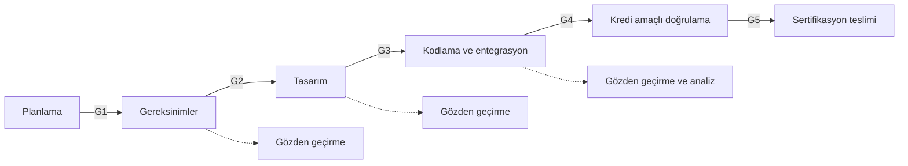

# Ek A: Örnek Geçiş Kriterleri

Geçiş kriterleri (transition criteria), bir yazılım sürecine ne zaman girilebileceğini
ve o süreçten ne zaman çıkılmış sayılacağını tanımlayan, planlarda yazılı ölçütlerdir.
Bu ek, her süreç için örnek giriş ve çıkış kriterleri ile zayıf bir kriteri güçlü hâle
getirmenin yollarını gösterir.

Buradaki tablolar bir şablon değil, başlangıç noktasıdır. Kriterler yazılım seviyesine,
ekip yapısına ve kullanılan araçlara göre uyarlanmalı ve
[5. Yazılım Planlama](../03-do178c-ile-gelistirme/05-yazilim-planlama.md) bölümünde
anlatılan planlara yazılmalıdır.

## Geçiş kriteri ne değildir?

Geçiş kriteri bir şelale modeli dayatmaz. Gereksinimlerin tamamı bitmeden tasarıma
başlanabilir; önemli olan, tasarıma giren her gereksinim kümesinin kendi giriş
kriterini karşılamasıdır. Kriterler bu yüzden çoğu zaman tüm proje için değil,
bir bileşen, bir işlev ya da bir sürüm için uygulanır.

Geçiş kriteri bir toplantı kararı da değildir. "Ekip hazır olduğumuza karar verdi"
ifadesi, neye bakılarak karar verildiğini söylemediği için kanıt değeri taşımaz.
İyi bir kriter, bir kayda ya da ölçüme bakılarak "karşılandı / karşılanmadı" diye
yanıtlanabilir.

## Süreçler ve geçiş noktaları

Her geçiş noktasında (G1–G5) sorulan soru aynıdır: Bir sonraki sürecin ihtiyaç duyduğu
girdi var mı, doğrulanmış mı ve konfigürasyon yönetimi altında mı?

## Örnek kriterler

Tablolarda geçen belge kısaltmaları: yazılım sertifikasyon planı (Plan for Software
Aspects of Certification, PSAC), yazılım başarı özeti (Software Accomplishment Summary,
SAS), yazılım konfigürasyon indeksi (Software Configuration Index, SCI) ve yaşam döngüsü
ortam konfigürasyon indeksi (Software Life Cycle Environment Configuration Index, SECI).
"Kredi amaçlı (for-credit) doğrulama", sonuçları sertifikasyon kanıtı olarak
kullanılacak resmî test koşumlarını anlatır. Diğer kısaltmalar için
[Kısaltmalar](../kaynaklar/kisaltmalar.md) sayfasına bakınız.

### G1 — Planlamadan geliştirmeye

| Tür | Örnek kriter | Kanıt |
|---|---|---|
| Giriş | Sistem gereksinimleri ve yazılım seviyesi tanımlanmış | Sistem gereksinim belgesi, emniyet değerlendirmesi çıktısı |
| Çıkış | Beş plan ve üç standart gözden geçirilmiş, bulgular kapatılmış | Gözden geçirme kayıtları |
| Çıkış | Planlar ve standartlar temel çizgiye (baseline) alınmış | Konfigürasyon kaydı |
| Çıkış | PSAC otoriteye gönderilmiş | Gönderim kaydı |

### G2 — Gereksinimlerden tasarıma

| Tür | Örnek kriter | Kanıt |
|---|---|---|
| Giriş | İlgili sistem gereksinimleri temel çizgide | Konfigürasyon kaydı |
| Çıkış | Bileşenin yüksek seviyeli gereksinimleri gözden geçirilmiş; açık büyük bulgu yok | Gözden geçirme kaydı |
| Çıkış | Her gereksinim bir sistem gereksinimine izlenebilir ya da türetilmiş olarak işaretli | İzlenebilirlik raporu |
| Çıkış | Türetilmiş gereksinimler (derived requirements) emniyet değerlendirmesine iletilmiş | İletim kaydı |

### G3 — Tasarımdan kodlamaya

| Tür | Örnek kriter | Kanıt |
|---|---|---|
| Giriş | Bileşenin yüksek seviyeli gereksinimleri G2'yi geçmiş | G2 kayıtları |
| Çıkış | Mimari ve düşük seviyeli gereksinimler gözden geçirilmiş | Gözden geçirme kaydı |
| Çıkış | Arayüz tanımları (veri tipleri, birimler, aralıklar) tamam | Arayüz belgesi |
| Çıkış | Düşük seviyeli gereksinimler yüksek seviyeli gereksinimlere izlenebilir | İzlenebilirlik raporu |

### G4 — Kodlamadan kredi amaçlı doğrulamaya

| Tür | Örnek kriter | Kanıt |
|---|---|---|
| Giriş | Kaynak kod gözden geçirilmiş; kodlama standardı denetim aracında ihlal yok ya da sapmalar gerekçeli | Gözden geçirme kaydı, araç raporu |
| Giriş | Kod derleniyor ve hedefe yüklenebiliyor; derleme yeniden üretilebilir | Derleme kaydı |
| Giriş | Test durumları ve prosedürleri gözden geçirilmiş | Gözden geçirme kaydı |
| Giriş | Test ortamı tanımlanmış ve yapılandırılmış | SECI, ortam kaydı |
| Çıkış | Tüm testler koşulmuş; başarısızlar problem raporuna bağlanmış | Test sonuçları, problem raporları |
| Çıkış | Gereksinim ve yapısal kapsam analizi tamam; boşluklar çözülmüş | Kapsam raporları |

### G5 — Doğrulamadan sertifikasyon teslimine

| Tür | Örnek kriter | Kanıt |
|---|---|---|
| Çıkış | Açık problem raporlarının her biri değerlendirilmiş | Problem raporu listesi ve değerlendirmesi |
| Çıkış | SAS ve SCI yayımlanmış, birbiriyle tutarlı | Belgeler, kalite güvencesi kontrolü |
| Çıkış | Yazılım uygunluk gözden geçirmesi tamamlanmış | Kalite güvencesi kaydı |
| Çıkış | Önceki tüm katılım aşaması bulguları kapanmış | Bulgu kapanış listesi |

## Zayıf kriteri güçlendirmek

| Zayıf ifade | Sorun | Güçlü ifade |
|---|---|---|
| "Gereksinimler büyük ölçüde tamamlandığında" | Ne kadar? Kim karar veriyor? | "Bileşenin tüm yüksek seviyeli gereksinimleri gözden geçirilmiş ve açık büyük bulgu yok" |
| "Kod hazır olduğunda" | "Hazır" tanımsız | "Kod gözden geçirilmiş, standart ihlali yok ya da sapmalar gerekçeli, temel çizgiye alınmış" |
| "Testler başarılı olduğunda" | Başarısız testlerin ne olacağı belli değil | "Tüm testler koşulmuş; başarısız her test bir problem raporuna bağlanmış ve değerlendirilmiş" |
| "Kalite güvencesi onayıyla" | Neye bakılarak onaylanacağı belli değil | "Kalite güvencesi, kriter listesini kayıtlarla karşılaştırmış ve uygunsuzluk açmamış" |

## Kriterlerin denetlenmesi

Geçiş kriterleri yazıldığı gibi uygulanmıyorsa, otorite bunu bir plan sapması olarak
görür. Kriterlerin uygulandığını genellikle kalite güvencesi denetler
([11. Yazılım Kalite Güvencesi](../03-do178c-ile-gelistirme/11-yazilim-kalite-guvencesi.md)).
Bir kriter pratikte işlemiyorsa sessizce aşılmamalı; plan güncellenmeli ve değişiklik
kayda alınmalıdır. Geçiş kriterleri aynı zamanda katılım aşaması denetimlerine
hazırlığın da omurgasıdır ([SW SOI-1](../kaynaklar/soi-1.md)).

## Bu ekten akılda kalması gerekenler

- Geçiş kriteri, bir kayda ya da ölçüme bakılarak yanıtlanabilen bir sorudur.
- Kriterler süreçleri sıraya dizmez; her iş ürününün bir sonraki sürece hazır
  olduğunu gösterir.
- "Büyük ölçüde", "hazır", "uygun" gibi ölçülemez ifadeler kriter değildir.
- İşlemeyen bir kriter aşılmaz, plan güncellenir.
