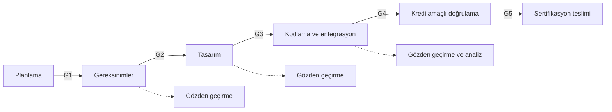

# Ek A: Örnek Geçiş Kriterleri

Geçiş kriterleri (transition criteria), bir yazılım sürecine ne zaman girilebileceğini
ve o süreçten ne zaman çıkılmış sayılacağını tanımlayan, planlarda yazılı ölçütlerdir.
Bu ek, her süreç için örnek giriş ve çıkış kriterleri ile zayıf bir kriteri güçlü hâle
getirmenin yollarını gösterir.

Buradaki tablolar bir şablon değil, başlangıç noktasıdır. Kriterler yazılım seviyesine,
ekip yapısına ve kullanılan araçlara göre uyarlanmalı ve
[5. Yazılım Planlama](../03-do178c-ile-gelistirme/05-yazilim-planlama.md) bölümünde
anlatılan planlara yazılmalıdır: geliştirme süreçlerinin kriterleri yazılım geliştirme
planında (Software Development Plan, SDP), doğrulamaya giriş kriterleri yazılım doğrulama
planında (Software Verification Plan, SVP) yer alır; konfigürasyon yönetimi ve kalite
güvencesi süreçlerinin kriterleri de kendi planlarında tanımlanır.

DO-178C geçiş kriterini, bir sürece girmek için sağlanması gereken asgari koşullar
olarak ele alır; "çıkış kriteri" standardın terimi değil, yaygın bir uygulamadır. İkisi
aynı kapının iki yüzüdür: bir süreçten çıkış için yazılan koşul, uygulamada bir
sonrakine giriş koşulunun parçası olur. Standart hazır bir kriter listesi de vermez;
planlardan her süreç için üç şeyi belirtmesini bekler: sürece ne girecek (başka
süreçlerin geri bildirimi dahil), o girdi üzerinde hangi doğrulama, konfigürasyon
yönetimi ya da kalite güvencesi faaliyeti yapılmış olacak ve hangi araç, yöntem ve
prosedür hazır bulunacak.

## Geçiş kriteri ne değildir?

Geçiş kriteri bir şelale modeli dayatmaz. Gereksinimlerin tamamı bitmeden tasarıma
başlanabilir; önemli olan, tasarıma giren her gereksinim kümesinin kendi giriş
kriterini karşılamasıdır. Kriterler bu yüzden çoğu zaman tüm proje için değil,
bir bileşen, bir işlev ya da bir sürüm için uygulanır. Aynı esneklik planlama için de
geçerlidir: ilgili faaliyetin kriteri sağlanıyorsa başka süreçler planlama süreci
tamamlanmadan başlayabilir.

Kısmi girdiyle ilerlemenin bir karşılığı vardır: girdilerinin bir kısmı eksikken
başlatılan süreç, sonradan gelen ya da değişen girdiler karşısında önceki çıktılarının
hâlâ geçerli olduğunu yeniden incelemek zorundadır. On gereksinimle başlanan tasarıma
on birincisi eklendiğinde soru "yeni gereksinim tasarlandı mı?" ile bitmez; "önceki
tasarım kararları hâlâ doğru mu?" diye de sorulur. Geri dönüşler de aynı mantıkla
kritere bağlanır. Temel çizgiye (baseline) alınmış bir veri değişecekse sürece yeniden
girişin de koşulları vardır: bir problem raporu ya da değişiklik talebi, değişiklik
etki analizi (change impact analysis) ve etkilenen gözden geçirmelerle testlerin
yinelenmesi
([10. Yazılım Konfigürasyon Yönetimi](../03-do178c-ile-gelistirme/10-yazilim-konfigurasyon-yonetimi.md)).

Geçiş kriteri bir toplantı kararı da değildir. "Ekip hazır olduğumuza karar verdi"
ifadesi, neye bakılarak karar verildiğini söylemediği için kanıt değeri taşımaz.
İyi bir kriter, bir kayda ya da ölçüme bakılarak "karşılandı / karşılanmadı" diye
yanıtlanabilir.

## Süreçler ve geçiş noktaları

Her geçiş noktasında (G1–G5) sorulan soru aynıdır: Bir sonraki sürecin ihtiyaç duyduğu
girdi var mı, doğrulanmış mı ve konfigürasyon yönetimi altında mı? Kesikli oklar,
gözden geçirme ve analizlerin geliştirmeye eşlik ettiğini hatırlatır; doğrulama,
sıranın sonunda bekleyen tek bir adım değildir.

Tablolardaki "Çıkış" satırları geride bırakılan sürecin tamamlaması gerekenleri,
"Giriş" satırları ise girilen sürecin bunlara ek olarak hazır bulmak istediği koşulları
(temel çizgi, ortam, başka süreçlerden gelen girdi) gösterir. Bir geçiş noktası, ikisi
birlikte sağlandığında geçilmiş sayılır.

## Örnek kriterler

Tablolarda geçen belge kısaltmaları: yazılım sertifikasyon planı (Plan for Software
Aspects of Certification, PSAC), yazılım başarı özeti (Software Accomplishment Summary,
SAS), yazılım konfigürasyon indeksi (Software Configuration Index, SCI) ve yazılım yaşam
döngüsü ortam konfigürasyon indeksi (Software Life Cycle Environment Configuration
Index, SECI). "Kredi amaçlı (for-credit) doğrulama", sonuçları sertifikasyon kanıtı
olarak kullanılacak resmî test koşularını anlatır. Yazılım uygunluk gözden geçirmesi
(software conformity review), kalite güvencesinin sertifikasyona sunulan sürüm için
yaptığı kapanış denetimidir; katılım aşaması (Stage of Involvement, SOI) ise otoritenin
projeyi denetlediği aşamalardan her biridir. Diğer kısaltmalar için
[Kısaltmalar](../kaynaklar/kisaltmalar.md) sayfasına bakınız.

### G1 — Planlamadan gereksinimlere

| Tür | Örnek kriter | Kanıt |
|---|---|---|
| Çıkış | Beş plan ve üç standart gözden geçirilmiş, bulgular kapatılmış | Gözden geçirme kayıtları |
| Çıkış | Planlar ve standartlar temel çizgiye alınmış | Konfigürasyon kaydı |
| Çıkış | PSAC otoriteye gönderilmiş | Gönderim kaydı |
| Giriş | İlgili sistem gereksinimleri temel çizgide; yazılım seviyesi belirlenmiş | Konfigürasyon kaydı, sistem emniyet değerlendirme sürecinin çıktısı |

### G2 — Gereksinimlerden tasarıma

| Tür | Örnek kriter | Kanıt |
|---|---|---|
| Çıkış | Bileşenin yüksek seviyeli gereksinimleri (high-level requirements) gözden geçirilmiş; açık büyük bulgu yok | Gözden geçirme kaydı |
| Çıkış | Her gereksinim bir sistem gereksinimine izlenebilir ya da türetilmiş gereksinim (derived requirement) olarak işaretli | İzlenebilirlik raporu |
| Çıkış | Türetilmiş gereksinimler gerekçeleriyle sistem süreçlerine (sistem emniyet değerlendirmesi dahil) iletilmiş | İletim kaydı |
| Giriş | Tasarımı yapılacak bileşenin yüksek seviyeli gereksinimleri temel çizgide | Konfigürasyon kaydı |

### G3 — Tasarımdan kodlamaya

| Tür | Örnek kriter | Kanıt |
|---|---|---|
| Çıkış | Mimari ve düşük seviyeli gereksinimler (low-level requirements) gözden geçirilmiş | Gözden geçirme kaydı |
| Çıkış | Arayüz tanımları (veri tipleri, birimler, aralıklar) tamam | Arayüz belgesi |
| Çıkış | Düşük seviyeli gereksinimler yüksek seviyeli gereksinimlere izlenebilir ya da türetilmiş olarak işaretli; türetilmiş olanlar sistem süreçlerine iletilmiş | İzlenebilirlik raporu, iletim kaydı |
| Giriş | Kodlanacak bileşenin mimarisi ve düşük seviyeli gereksinimleri temel çizgide | Konfigürasyon kaydı |
| Giriş | Derleyici, bağlayıcı ve seçenekleri belirlenmiş ve kayıtlı | SECI |

### G4 — Kodlamadan kredi amaçlı doğrulamaya

| Tür | Örnek kriter | Kanıt |
|---|---|---|
| Çıkış | Kaynak kod gözden geçirilmiş; kodlama standardı denetim aracında ihlal yok ya da sapmalar gerekçeli | Gözden geçirme kaydı, araç raporu |
| Çıkış | Kod derleniyor ve hedefe yüklenebiliyor; derleme yeniden üretilebilir | Derleme kaydı |
| Giriş | Test durumları ve prosedürleri gözden geçirilmiş | Gözden geçirme kaydı |
| Giriş | Test ortamı tanımlanmış, yapılandırılmış ve kayıtlı | SECI, ortam kaydı |
| Giriş | Koşulacak kod, test durumları ve prosedürleri temel çizgide | Konfigürasyon kaydı |
| Giriş | Kuru koşu (dry run) tamamlanmış; bilinen başarısızlıklar problem raporuna bağlı | Kuru koşu kaydı, problem raporları |

### G5 — Doğrulamadan sertifikasyon teslimine

| Tür | Örnek kriter | Kanıt |
|---|---|---|
| Çıkış | Tüm testler koşulmuş; başarısızlar problem raporuna bağlanmış | Test sonuçları, problem raporları |
| Çıkış | Gereksinim kapsam analizi ve yapısal kapsam analizi (structural coverage analysis) tamam; boşluklar çözülmüş | Kapsam raporları |
| Giriş | Sertifikasyona esas sürüm son temel çizgide | Konfigürasyon kaydı, SCI |
| Giriş | Açık problem raporlarının her biri emniyet ve işlev etkisi açısından değerlendirilmiş | Problem raporu listesi ve değerlendirmesi |
| Giriş | SAS ve SCI yayımlanmış, birbiriyle tutarlı | Belgeler, kalite güvencesi kontrolü |
| Giriş | Yazılım uygunluk gözden geçirmesi tamamlanmış | Kalite güvencesi kaydı |
| Giriş | Önceki tüm katılım aşaması bulguları kapanmış | Bulgu kapanış listesi |

## Seviyeye göre uyarlama

Yukarıdaki tablolar seviyeden bağımsız yazılmıştır; plana aktarılırken her kriter, o
yazılım seviyesinde aranan hedeflerle eşleştirilir. Örneğin yapısal kapsam ölçütü
seviyeyle birlikte satır kapsamadan (statement coverage) karar kapsamaya (decision
coverage), oradan değiştirilmiş koşul/karar kapsamaya (modified condition/decision
coverage, MC/DC) yükselir. Veri ve kontrol bağlaşımı (data and control coupling) analizi
Seviye A, B ve C'de aranır; bağımsızlık (independence) ise yalnızca belirli
hedeflerde şarttır. Ölçütlerin tanımı
[9. Yazılım Doğrulama](../03-do178c-ile-gelistirme/09-yazilim-dogrulama.md) bölümündedir.

| Kriter | Seviye A | Seviye B | Seviye C | Seviye D |
|---|---|---|---|---|
| Yapısal kapsam analizi tamam (G5) | MC/DC, karar ve satır kapsama; veri ve kontrol bağlaşımı | Karar ve satır kapsama; veri ve kontrol bağlaşımı | Satır kapsama; veri ve kontrol bağlaşımı | Yapısal kapsam aranmaz; kriter yüksek seviyeli gereksinimlerin test kapsamıyla sınırlı kalır |
| Gözden geçirmeyi yazar dışında biri yapmış (G2–G4) | Bağımsızlık aranan hedeflerde şart | Bağımsızlık aranan hedeflerde şart; bu hedefler A'dakinden azdır | Standart şartı değil; iyi uygulama | Standart şartı değil; iyi uygulama |
| Kalite güvencesi kriterlerin sağlandığını denetlemiş (tüm geçişler) | Standardın hedefi; bağımsızlıkla | Standardın hedefi; bağımsızlıkla | Standardın hedefi; bağımsızlıkla | Ayrı hedef olarak aranmaz, yaşam döngüsünün ve geçiş kriterlerinin tanımlanması da bu seviyede hedef değildir; planlara uygunluk hedefi geçerlidir |

Düşük seviyede bir hedefin aranmaması, ilgili kriteri yazmayı yasaklamaz; yalnızca
kriterin standart gereği değil, projenin kendi kararı olduğunu gösterir. Yine de plana
yazılan her kriter bağlayıcıdır: kendi koyduğu kriteri uygulamayan ekip de plan sapması
üretir.

## Zayıf kriteri güçlendirmek

| Zayıf ifade | Sorun | Güçlü ifade |
|---|---|---|
| "Gereksinimler büyük ölçüde tamamlandığında" | Ne kadar? Kim karar veriyor? | "Bileşenin tüm yüksek seviyeli gereksinimleri gözden geçirilmiş ve açık büyük bulgu yok" |
| "Tasarım uygun bulunduğunda" | Kim, neye göre uygun buluyor? | "Mimari ve düşük seviyeli gereksinimler tasarım standardına göre gözden geçirilmiş, bulgular kapatılmış" |
| "Kod hazır olduğunda" | "Hazır" tanımsız | "Kod gözden geçirilmiş, standart ihlali yok ya da sapmalar gerekçeli, temel çizgiye alınmış" |
| "Testler başarılı olduğunda" | Başarısız testlerin ne olacağı belli değil | "Tüm testler koşulmuş; başarısız her test bir problem raporuna bağlanmış ve değerlendirilmiş" |
| "Kalite güvencesi onayıyla" | Neye bakılarak onaylanacağı belli değil | "Kalite güvencesi, kriter listesini kayıtlarla karşılaştırmış ve uygunsuzluk açmamış" |

## Kriterlerin denetlenmesi

Geçiş kriterleri yazıldığı gibi uygulanmıyorsa, otorite bunu bir plan sapması olarak
görür. Kriterlerin sağlandığına dair güvence elde etmek, DO-178C'de kalite güvencesi
sürecinin hedeflerinden biridir; bu hedef Seviye A, B ve C'de, bağımsızlıkla aranır
([11. Yazılım Kalite Güvencesi](../03-do178c-ile-gelistirme/11-yazilim-kalite-guvencesi.md)).
Kalite güvencesinin bunu yapabilmesi için her kriterin arkasında gösterilebilir bir
kayıt bulunmalı, kredi amaçlı koşu gibi tanıklık etmek isteyebileceği geçişler de
kendisine önceden bildirilmelidir. Bir kriter pratikte işlemiyorsa sessizce
aşılmamalı; plan güncellenmeli ve değişiklik kayda alınmalıdır. Geçiş kriterleri aynı
zamanda katılım aşaması denetimlerine hazırlığın da omurgasıdır
([SW SOI-1](../kaynaklar/soi-1.md)).

## Bu ekten akılda kalması gerekenler

- Geçiş kriteri, bir kayda ya da ölçüme bakılarak yanıtlanabilen bir sorudur. DO-178C
  onu sürece giriş için asgari koşul olarak tanımlar, içeriğini planlara bırakır.
- Kriterler şelale dayatmaz; her iş ürününün bir sonraki sürece hazır olduğunu
  gösterir. Kısmi girdiyle başlanan işte sonradan gelen girdi, önceki çıktının yeniden
  incelenmesini gerektirir.
- Bir süreçten çıkış koşulu, bir sonrakine giriş koşulunun parçasıdır; kredi amaçlı
  doğrulamaya yalnızca temel çizgideki kod, test prosedürleri ve kayıtlı ortamla girilir.
- Kriterler yazılım seviyesine göre uyarlanır; standardın aramadığı bir kriter projenin
  kendi kararıdır, ama plana yazıldıysa bağlayıcıdır.
- "Büyük ölçüde", "hazır", "uygun" gibi ölçülemez ifadeler kriter değildir.
- Kriterlerin sağlandığına dair güvence kalite güvencesinin işidir; işlemeyen bir
  kriter aşılmaz, plan güncellenir.
