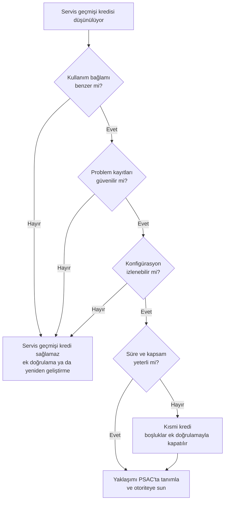

# Ek D: Yazılım Servis Geçmişi Soruları

Bu ek, bir yazılımın sahadaki geçmişini sertifikasyon kredisi olarak öne sürmeden önce
sorulması gereken soruları toplar. Sorular, ürün servis geçmişi (product service
history) argümanının dayanması gereken dört koşula göre gruplanmıştır: benzer kullanım
bağlamı, güvenilir problem kayıtları, konfigürasyon kararlılığı ve yeterli çalışma
süresi.

Servis geçmişinin neden sanıldığından zor bir argüman olduğu
[24. Yazılım Yeniden Kullanımı](../05-ozel-konular/24-yazilim-yeniden-kullanimi.md)
bölümünde anlatılır. Bu liste, yazılım sertifikasyon planını (Plan for Software Aspects
of Certification, PSAC) yazmadan önce dürüst bir ön eleme yapmak içindir. Dört koşul
aynı ağırlıkta değildir: ilk üçü ön koşuldur, dördüncüsü kredinin ölçüsünü belirler.
Kullanım bağlamı, problem kayıtları ya da konfigürasyon grubunda tatmin edici yanıt
yoksa, argümana yatırım yapmadan önce başka bir güvence yolunu değerlendirmek daha
ucuzdur.

DO-178C, ürün servis geçmişini alternatif yöntemler arasında (12.3.4) ele alır; geçmişin
ilgililiğini, birikmiş miktarın yeterliliğini, serviste bulunan problemlerin toplanıp
analiz edilmesini ve PSAC'ta bildirilecek bilgileri ayrı başlıklarda değerlendirir. Dört
koşul ve buradaki sorular bu kitap için özgün olarak derlenmiştir; standardın
başlıklarıyla bire bir örtüşmez. Daha ayrıntılı bir soru kümesi arayan okur,
FAA'nın DO-178B döneminde yayımladığı Software Service History Handbook'a
(DOT/FAA/AR-01/116) bakabilir.

## Ön eleme akışı

İlk üç sorunun "Hayır" kolu krediyi sıfırlar, çünkü bağlamı farklı, kaydı güvenilmez ya
da sürümü belirsiz bir geçmişin neyi kanıtladığı söylenemez. Bağlam sorusu yine de ya
hep ya hiç değildir: ortam yalnızca kısmen farklıysa standart, farkın hedef ortamda ek
doğrulamayla kapatılmasını bekler; "Hayır" kolu karşılaştırılamayacak kadar farklı bir
bağlam içindir. Süre ve kapsam ise derecelidir: geçmiş yalnızca gerçekten çalışmış işlev
ve modlar için kanıt üretir, geri kalanı ek doğrulamayla kapatılır. İstenen kredi
büyüdükçe gösterilmesi gereken geçmiş de büyür; standart bunun için sayısal bir eşik
vermez. Bu yüzden kredi tam da olsa kısmi de olsa yaklaşım PSAC'ta tanımlanır ve
sertifikasyon otoritesiyle erkenden konuşulur.

## Kullanım bağlamı

- Yazılım sahada hangi sistemde, hangi işlev için kullanıldı?
- Yeni kullanımda işlev, arayüzler ve çalışma modları aynı mı? Farklıysa hangi
  kısımlar farklı?
- Ortam koşulları (sıcaklık, titreşim, elektromanyetik ortam, güç kesintileri)
  karşılaştırılabilir mi?
- Girdi aralıkları ve veri hızları yeni kullanımla aynı mı? Yeni kullanım, yazılımı
  daha önce hiç görmediği aralıklara itiyor mu?
- Önceki kullanımda yazılım seviyesi (software level) neydi; yeni kullanım daha yüksek
  bir seviye mi istiyor?
- Önceki kullanım yerde mi, havada mı, başka bir sektörde mi? (Yer sistemi geçmişi
  uçuş bağlamı için doğrudan kredi sağlamaz.)

## Problem kayıtları

- Servis dönemi boyunca hatalar sistematik olarak raporlandı mı? Raporlama süreci
  yazılı mı ve kim işletti?
- Raporlar sınıflandırılmış mı; yazılım kaynaklı olanlar donanım ve operasyon
  kaynaklı olanlardan ayrılabiliyor mu?
- Kapatılan raporlar için kök neden ve düzeltme bilgisi var mı?
- "Hiç hata raporu yok" deniyorsa, bunun raporlama sisteminin işlemediği anlamına
  gelmediği nasıl gösterilecek?
- Kullanıcıların hatayı fark edip raporlama olasılığı ne? (Gözlenmesi zor hatalar,
  örneğin yanlış ama makul görünen bir değer, raporlara hiç yansımamış olabilir.)
- Servis döneminde emniyeti etkileyen bir problem ya da yazılıma bağlanan bir uçuşa
  elverişlilik direktifi (airworthiness directive) çıktı mı? Çıktıysa kök neden kredi
  istenen sürümde giderilmiş mi? (Standart, serviste görülen emniyetle ilgili bütün
  problemlerin düzeltildiğinin teyit edilmesini bekler.)
- Bulunan hatalar geliştirme sürecindeki bir yetersizliğe işaret ediyor mu? (Hep aynı
  arayüzde ya da hep sınır değerlerde çıkan hatalar, aynı türden bulunmamış başka
  hatalar olabileceğini düşündürür.)
- Kredi istenen sürümde açık kalan problem raporları hangileri; her birinin yeni
  kullanım bağlamındaki etkisi değerlendirildi mi? (Eski bağlamda zararsız sayılan bir
  kısıt yeni bağlamda emniyeti etkileyebilir.)
- Kayıtlara erişim hakkınız var mı; veri başka bir kuruluşun elindeyse sözleşmesel
  olarak kullanılabiliyor mu?

## Konfigürasyon kararlılığı

- Kredi istenen sürüm tam olarak hangisi; sahadaki sürümlerle ilişkisi konfigürasyon
  kayıtlarıyla gösterilebiliyor mu?
- Servis dönemi boyunca kaç değişiklik yapıldı? Her değişiklikten sonra geçmiş
  saatlerin hangi kısmı hâlâ geçerli sayılabilir?
- Aynı kaynak koddan farklı derleyici, derleme seçeneği ya da hedef işlemciyle
  üretilmiş sürümler var mı?
- Konfigürasyon verisi ya da parametre verisi öğeleri (parameter data item, PDI)
  sahada değiştirildi mi? Değiştiyse saatler hangi değer kümesiyle birikti?
  (Bkz. [22. Konfigürasyon Verisi](../05-ozel-konular/22-konfigurasyon-verisi.md).)
- Yeni kullanım için yazılımda değişiklik gerekiyor mu? Değişen kısım için servis
  geçmişi kredisi yoktur; değişiklik etki analizi (change impact analysis) gerekir.
  Analizin taradığı eksenler
  [10. Yazılım Konfigürasyon Yönetimi](../03-do178c-ile-gelistirme/10-yazilim-konfigurasyon-yonetimi.md)
  bölümündedir.

## Çalışma süresi ve kapsamı

- Süre, yazılımın çalışma biçimine uyan bir ölçüyle mi veriliyor: sürekli çalışan yazılım
  için uçuş saati, istek üzerine çalışan yazılım için istek sayısı?
- Toplam çalışma saati ne kadar; filo büyüklüğü ve kullanım profili ne?
- Çalışma saatleri nasıl ölçüldü; tahmin mi, kayıt mı?
- Saatler farklı yazılım sürümleri ya da donanım varyantları üzerinden toplanarak mı
  elde edildi? Öyleyse her birinin kredi istenen konfigürasyonu temsil ettiği nasıl
  gösteriliyor?
- Bu süre, yeni kullanımın yazılım seviyesine ve sistemin emniyet hedeflerine göre
  anlamlı mı? (Bu, yazılıma sayısal bir arıza olasılığı atamak demek değildir;
  olasılık hedefi sistem düzeyindeki arıza durumuna aittir.)
- Serviste gözlenen hata oranı (error rate) ne; dönem boyunca düşüyor mu, yoksa yeni
  hatalar aynı hızla mı çıkıyor? (Artan bir eğilimin açıklanması beklenir.)
- Kritik çalışma modları ve nadir durumlar (acil durum modları, yedeğe geçiş, aşırı
  yük) servis döneminde gerçekten tetiklendi mi, kaç kez?
- Serviste hiç çalışmamış işlevler ya da devre dışı bırakılmış kod (deactivated code)
  var mı; yeni kullanım bunları etkinleştirecek mi? (Çalışmamış kod için servis
  geçmişi kanıt üretmez.)
- Servis geçmişi hangi DO-178C hedefleri için kanıt olarak kullanılacak, hangileri
  için kullanılmayacak? (Servis geçmişi gözlenen davranışı kanıtlar; yapısal kapsam
  gibi hedeflerin yerini tam olarak tutmaz.)

## Otoriteyle mutabakat

- Yaklaşım PSAC'ta açıkça tanımlandı mı: hangi sürüm, hangi hedefler için, hangi
  veriyle?
- Otoriteyle hangi aşamada konuşuldu? (Tercihen planlama aşamasında, SOI-1'den önce;
  bkz. [12. Sertifikasyon İrtibatı](../03-do178c-ile-gelistirme/12-sertifikasyon-irtibati.md)
  ve [SW SOI-1](../kaynaklar/soi-1.md).)
- Kabul edilebilir süre ve hata oranı için ölçüt önceden anlaşıldı mı? Neyin hata
  sayılacağı ve hangi tür problemin servis geçmişini geçersiz kılacağı PSAC'ta tanımlı mı?
- Servis geçmişinin kullanımı ve sonuçları sistem emniyet değerlendirme sürecinin önünden
  geçti mi?
- Servis geçmişinin karşılamadığı hedefler için hangi ek doğrulama faaliyetleri
  planlandı?

## Sık yapılan hatalar

| Hata | Sonuç |
|---|---|
| Toplam saati tek ölçüt olarak sunmak | Kritik modların hiç tetiklenmediği ortaya çıkınca argüman çöker |
| Kayıt sisteminin işleyişini göstermeden "hata yok" demek | Kanıt değeri sıfıra iner |
| Sürüm ilişkisini sonradan kurmaya çalışmak | Hangi geçmişin hangi sürüme ait olduğu tartışmalı kalır |
| Farklı sürüm ve varyantların saatlerini ayırmadan toplamak | Kredi istenen konfigürasyonun gerçek süresi bilinmez |
| Otoriteye proje sonunda gitmek | Reddedilen argüman için harcanan aylar boşa gider |

## Bu ekten akılda kalması gerekenler

- Benzer kullanım bağlamı, güvenilir problem kayıtları ve konfigürasyon kararlılığı ön
  koşuldur; biri eksikse servis geçmişi kredi sağlamaz.
- Süre ve kapsam kredinin ölçüsünü belirler; yetersizse kredi kısmidir ve boşluk ek
  doğrulamayla kapatılır.
- Gereken geçmiş miktarı yazılım seviyesine ve sistemin emniyet hedeflerine, ortam
  farkına, servis geçmişiyle karşılanacak hedeflere ve eldeki öteki kanıta bağlıdır;
  hata oranı izlenir, yazılıma arıza olasılığı atanmaz.
- "Uzun süre sorunsuz çalıştı" bir kanıt değil, kanıt aranacak bir iddiadır.
- Servis geçmişi çoğu zaman tek başına bir yol değil, ek doğrulamayla birleşen
  destekleyici bir argümandır.
- Otoriteyle erken mutabakat, en pahalı riski (geç gelen reddi) ortadan kaldırır.
