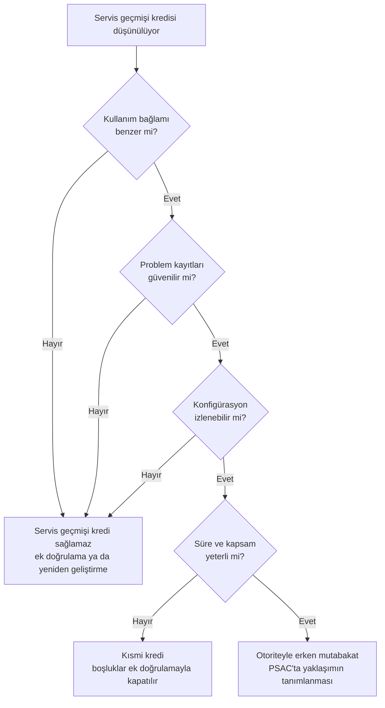

# Ek D: Yazılım Servis Geçmişi Soruları

Bu ek, bir yazılımın sahadaki geçmişini sertifikasyon kredisi olarak öne sürmeden önce
sorulması gereken soruları toplar. Sorular, ürün servis geçmişi (product service
history) argümanının dayanması gereken dört koşula göre gruplanmıştır: benzer kullanım
bağlamı, güvenilir problem kayıtları, konfigürasyon kararlılığı ve yeterli çalışma
süresi.

Servis geçmişinin neden sanıldığından zor bir argüman olduğu
[24. Yazılım Yeniden Kullanımı](../05-ozel-konular/24-yazilim-yeniden-kullanimi.md)
bölümünde anlatılır. Bu liste, plan yazmadan önce dürüst bir ön eleme yapmak içindir:
dört gruptan birinde bile tatmin edici yanıt yoksa, argümana yatırım yapmadan önce
başka bir güvence yolunu değerlendirmek daha ucuzdur.

## Ön eleme akışı

## Kullanım bağlamı

- Yazılım sahada hangi sistemde, hangi işlev için kullanıldı?
- Yeni kullanımda işlev, arayüzler ve çalışma modları aynı mı? Farklıysa hangi
  kısımlar farklı?
- Ortam koşulları (sıcaklık, titreşim, elektromanyetik ortam, güç kesintileri)
  karşılaştırılabilir mi?
- Girdi aralıkları ve veri hızları yeni kullanımla aynı mı? Yeni kullanım, yazılımı
  daha önce hiç görmediği aralıklara itiyor mu?
- Önceki kullanımda yazılımın atanmış seviyesi neydi; yeni kullanım daha yüksek bir
  seviye mi istiyor?
- Önceki kullanım yerde mi, havada mı, başka bir sektörde mi? (Yer sistemi geçmişi
  uçuş bağlamı için doğrudan kredi sağlamaz.)

## Problem kayıtları

- Servis dönemi boyunca hatalar sistematik olarak raporlandı mı? Raporlama süreci
  yazılı mı ve kim işletti?
- Raporlar sınıflandırılmış mı; yazılım kaynaklı olanlar donanım ve operasyon
  kaynaklı olanlardan ayrılabiliyor mu?
- Kapatılan raporlar için kök neden ve düzeltme bilgisi var mı?
- "Hiç hata raporu yok" deniyorsa, bunun raporlama sisteminin işlemediği anlamına
  gelmediği nasıl gösterilecek?
- Kullanıcıların hatayı fark edip raporlama olasılığı ne? (Gözlenmesi zor hatalar,
  örneğin yanlış ama makul görünen bir değer, raporlara hiç yansımamış olabilir.)
- Kayıtlara erişim hakkınız var mı; veri başka bir kuruluşun elindeyse sözleşmesel
  olarak kullanılabiliyor mu?

## Konfigürasyon kararlılığı

- Kredi istenen sürüm tam olarak hangisi; sahadaki sürümlerle ilişkisi konfigürasyon
  kayıtlarıyla gösterilebiliyor mu?
- Servis dönemi boyunca kaç değişiklik yapıldı? Her değişiklikten sonra geçmiş
  saatlerin hangi kısmı hâlâ geçerli sayılabilir?
- Aynı kaynak koddan farklı derleyici, derleme seçeneği ya da hedef işlemciyle
  üretilmiş sürümler var mı?
- Yapılandırma verisi ya da parametreler sahada değiştirildi mi?
- Yeni kullanım için yazılımda değişiklik gerekiyor mu? Değişen kısım için servis
  geçmişi kredisi yoktur; değişiklik etki analizi gerekir.

## Çalışma süresi ve kapsamı

- Toplam çalışma saati ne kadar; filo büyüklüğü ve kullanım profili ne?
- Bu süre, hedeflenen arıza olasılığına göre anlamlı mı?
- Kritik çalışma modları ve nadir durumlar (acil durum modları, yedeğe geçiş, aşırı
  yük) servis döneminde gerçekten tetiklendi mi, kaç kez?
- Çalışma saatleri nasıl ölçüldü; tahmin mi, kayıt mı?
- Servis geçmişi hangi DO-178C hedefleri için kanıt olarak kullanılacak, hangileri
  için kullanılmayacak? (Servis geçmişi gözlenen davranışı kanıtlar; yapısal kapsam
  gibi hedeflerin yerini tam olarak tutmaz.)

## Otoriteyle mutabakat

- Yaklaşım, yazılım sertifikasyon planında (Plan for Software Aspects of
  Certification, PSAC) açıkça tanımlandı mı?
- Otoriteyle hangi aşamada konuşuldu? (Tercihen planlama aşamasında, SOI-1'den önce.)
- Kabul edilebilir süre ve problem oranı için ölçüt önceden anlaşıldı mı?
- Servis geçmişinin karşılamadığı hedefler için hangi ek doğrulama faaliyetleri
  planlandı?

## Sık yapılan hatalar

| Hata | Sonuç |
|---|---|
| Toplam saati tek ölçüt olarak sunmak | Kritik modların hiç tetiklenmediği ortaya çıkınca argüman çöker |
| Kayıt sisteminin işleyişini göstermeden "hata yok" demek | Kanıt değeri sıfıra iner |
| Sürüm ilişkisini sonradan kurmaya çalışmak | Hangi geçmişin hangi sürüme ait olduğu tartışmalı kalır |
| Otoriteye proje sonunda gitmek | Reddedilen argüman için harcanan aylar boşa gider |

## Bu ekten akılda kalması gerekenler

- Servis geçmişi dört koşul birlikte sağlandığında anlamlıdır; biri eksikse kredi
  sağlamaz.
- "Uzun süre sorunsuz çalıştı" bir kanıt değil, kanıt aranacak bir iddiadır.
- Servis geçmişi çoğu zaman tek başına bir yol değil, ek doğrulamayla birleşen
  destekleyici bir argümandır.
- Otoriteyle erken mutabakat, en pahalı riski (geç gelen reddi) ortadan kaldırır.
