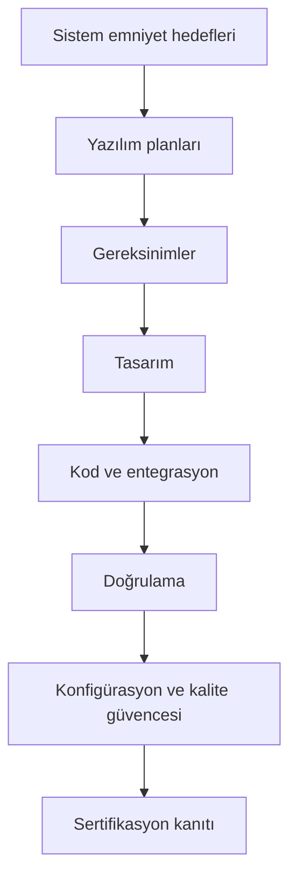

# DO-178C ile Emniyet-Kritik Aviyonik Yazılım

Bu kitap, DO-178C ekseninde emniyet-kritik aviyonik yazılım geliştirmeyi, doğrulamayı
ve sertifikasyon kanıtı üretmeyi Türkçe ve özgün bir dille anlatır. Amaç, standardı
yalnızca maddeler halinde özetlemek değil; neden bu beklentilerin bulunduğunu, pratikte
nasıl uygulandığını ve tipik proje kararlarını nasıl etkilediğini göstermektir.

Kitap; uçuş bilgisayarları, görev yazılımı, yer destek araçları ve sertifikasyon
sürecinde karşılaşılan yazılım iş ürünlerini aynı çerçevede ele alır. Böylece okuyucu
yalnızca belge isimlerini değil, o belgelerin proje akışındaki yerini, birbirleriyle
olan bağıntısını ve emniyet hedefleriyle ilişkisini de görür.

Bu içerik, yeni başlayan bir mühendisin konuyu sistemli biçimde öğrenmesine yardımcı
olacak kadar açıklayıcı; deneyimli bir ekip üyesinin ise kavramlar arasındaki ilişkiyi
daha net kurmasını sağlayacak kadar ayrıntılı olacak şekilde yazılmıştır.

## Bu sayfa nasıl kullanılmalı?

- **Hızlı başlangıç** istiyorsanız önce [Giriş ve Genel Bakış](./01-giris/01-giris-ve-genel-bakis.md) sayfasını okuyun.
- **Süreç akışı** görmek istiyorsanız doğrudan planlama, gereksinim, tasarım ve doğrulama
  bölümlerine ilerleyin.
- **Başvuru arıyorsanız** kitap sonundaki kaynaklar ve ekler bölümünü birlikte kullanın.
- **Bir konuya takıldıysanız** blog yazılarını destekleyici kısa notlar gibi değerlendirin;
  çoğu yazı, kitabın daha geniş akışındaki bir kavrama açıklık getirmek için yazılmıştır.

Bu sıralama zorunlu bir okuma emri değil; ama ilk kez okuyan biri için en az sürtünmeli
başlangıç rotasını verir.

## Bu kitap ne değildir?

- Bir standart çevirisi değildir.
- Belge maddelerini ezberleten bir özet kitap değildir.
- Tek bir proje tipine kilitlenmiş dar bir uygulama rehberi değildir.

## Bu kitap neyi hedefler?

- DO-178C’nin mantıksal yapısını açıklamak
- Emniyet hedefleri ile yazılım iş ürünleri arasındaki bağı kurmak
- Planlama, geliştirme, doğrulama ve güvence faaliyetlerini ilişkilendirmek
- Araç kalifikasyonu ve ek dokümanların ne zaman devreye girdiğini göstermek
- Özel konuların neden sertifikasyon açısından önemli olduğunu anlatmak

## Okuma önerisi

Kitabı baştan sona sıralı okumak en iyi yaklaşımdır; ancak belirli bir konu üzerinde
çalışıyorsanız ilgili bölüme doğrudan da geçebilirsiniz. Örneğin:

- bir proje başlangıcındaysanız planlama bölümlerini,
- bir gereksinim seti üzerinde çalışıyorsanız gereksinim ve tasarım bölümlerini,
- test aşamasındaysanız doğrulama ve geçiş kriterleri bölümlerini,
- araç kullanımı ya da model tabanlı geliştirme tartışması yapıyorsanız ek dokümanları
  birlikte okumalısınız.

## Kavramsal akış

Bu akış düz bir üretim hattı gibi görünse de gerçekte geri beslemelidir. Doğrulama
bulguları gereksinim dilini düzeltebilir; tasarım eksikleri test kapsamını etkileyebilir;
konfigürasyon yönetimi ise tüm çıktılar arasındaki tutarlılığı korur.

## İçindekiler

### Kısım I — Giriş
1. [Giriş ve Genel Bakış](./01-giris/01-giris-ve-genel-bakis.md)

### Kısım II — Emniyet-Kritik Yazılım Geliştirmenin Bağlamı
2. [Sistem Bağlamında Yazılım](./02-baglam/02-sistem-baglaminda-yazilim.md)
3. [Sistem Emniyet Değerlendirmesi Bağlamında Yazılım](./02-baglam/03-sistem-emniyet-degerlendirmesi-baglaminda-yazilim.md)

### Kısım III — DO-178C ile Emniyet-Kritik Yazılım Geliştirme
4. [DO-178C ve Destekleyici Dokümanlara Genel Bakış](./03-do178c-ile-gelistirme/04-do178c-genel-bakis.md)
5. [Yazılım Planlama](./03-do178c-ile-gelistirme/05-yazilim-planlama.md)
6. [Yazılım Gereksinimleri](./03-do178c-ile-gelistirme/06-yazilim-gereksinimleri.md)
7. [Yazılım Tasarımı](./03-do178c-ile-gelistirme/07-yazilim-tasarimi.md)
8. [Yazılım Gerçekleştirme: Kodlama ve Entegrasyon](./03-do178c-ile-gelistirme/08-yazilim-gerceklestirme-kodlama-entegrasyon.md)
9. [Yazılım Doğrulama](./03-do178c-ile-gelistirme/09-yazilim-dogrulama.md)
10. [Yazılım Konfigürasyon Yönetimi](./03-do178c-ile-gelistirme/10-yazilim-konfigurasyon-yonetimi.md)
11. [Yazılım Kalite Güvencesi](./03-do178c-ile-gelistirme/11-yazilim-kalite-guvencesi.md)
12. [Sertifikasyon İrtibatı](./03-do178c-ile-gelistirme/12-sertifikasyon-irtibati.md)

### Kısım IV — Araç Kalifikasyonu ve DO-178C Ekleri
13. [DO-330 ve Yazılım Aracı Kalifikasyonu](./04-arac-kalifikasyonu-ve-ekler/13-do330-arac-kalifikasyonu.md)
14. [DO-331 ve Model Tabanlı Geliştirme ve Doğrulama](./04-arac-kalifikasyonu-ve-ekler/14-do331-model-tabanli-gelistirme.md)
15. [DO-332 ve Nesne Yönelimli Teknoloji ve İlgili Teknikler](./04-arac-kalifikasyonu-ve-ekler/15-do332-nesne-yonelimli-teknoloji.md)
16. [DO-333 ve Biçimsel Yöntemler](./04-arac-kalifikasyonu-ve-ekler/16-do333-bicimsel-yontemler.md)

### Kısım V — Özel Konular
17. [Kapsanmayan Kodlar: Ölü, Gereksiz ve Devre Dışı Bırakılmış Kodlar](./05-ozel-konular/17-kapsanmayan-kodlar.md)
18. [Sahada Yüklenebilir Yazılım](./05-ozel-konular/18-sahada-yuklenebilir-yazilim.md)
19. [Kullanıcı Tarafından Değiştirilebilir Yazılım](./05-ozel-konular/19-kullanici-tarafindan-degistirilebilir-yazilim.md)
20. [Gerçek Zamanlı İşletim Sistemleri](./05-ozel-konular/20-gercek-zamanli-isletim-sistemleri.md)
21. [Yazılım Bölümlemesi](./05-ozel-konular/21-yazilim-bolumlemesi.md)
22. [Konfigürasyon Verisi](./05-ozel-konular/22-konfigurasyon-verisi.md)
23. [Havacılık Verileri](./05-ozel-konular/23-havacilik-verileri.md)
24. [Yazılım Yeniden Kullanımı](./05-ozel-konular/24-yazilim-yeniden-kullanimi.md)
25. [Tersine Mühendislik](./05-ozel-konular/25-tersine-muhendislik.md)
26. [Yazılım Yaşam Döngüsü Faaliyetlerinde Dış Kaynak Kullanımı](./05-ozel-konular/26-dis-kaynak-kullanimi.md)

### Ekler
- [Ek A: Örnek Geçiş Kriterleri](./06-ekler/01-ek-a-ornek-gecis-kriterleri.md)
- [Ek B: Gerçek Zamanlı İşletim Sistemlerinde Endişe Alanları](./06-ekler/02-ek-b-rtos-endise-alanlari.md)
- [Ek C: Gerçek Zamanlı İşletim Sistemi Seçiminde Sorulacak Sorular](./06-ekler/03-ek-c-rtos-secim-sorulari.md)
- [Ek D: Yazılım Servis Geçmişi Soruları](./06-ekler/04-ek-d-servis-gecmisi-sorulari.md)

### Kaynaklar
- [Kısaltmalar](./kaynaklar/kisaltmalar.md)
- [SW SOI-1](./kaynaklar/soi-1.md)
- [SW SOI-2](./kaynaklar/soi-2.md)
- [SW SOI-3](./kaynaklar/soi-3.md)
- [SW SOI-4](./kaynaklar/soi-4.md)
