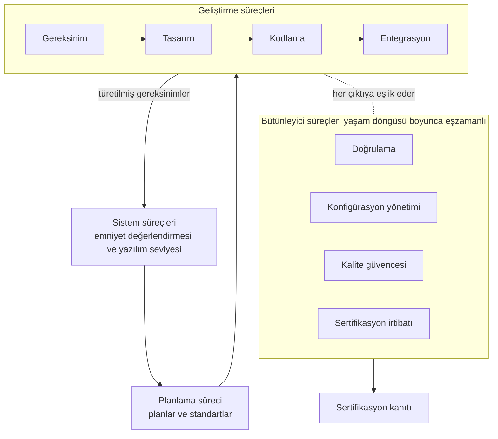

# DO-178C ile Emniyet-Kritik Aviyonik Yazılım

Bu kitap, DO-178C ekseninde emniyet-kritik aviyonik yazılım geliştirmeyi, doğrulamayı
ve sertifikasyon kanıtı üretmeyi Türkçe ve özgün bir dille anlatır. Amaç, standardı
yalnızca maddeler hâlinde özetlemek değil; neden bu beklentilerin bulunduğunu, pratikte
nasıl uygulandığını ve tipik proje kararlarını nasıl etkilediğini göstermektir.

Kitap, yazılımın sistem ve emniyet değerlendirmesi içindeki yerinden başlar; ardından
DO-178C'nin yaşam döngüsü süreçlerini (planlama, gereksinim, tasarım, kodlama ve
entegrasyon, doğrulama, konfigürasyon yönetimi, kalite güvencesi, sertifikasyon
irtibatı), araç kalifikasyonunu ve teknoloji eklerini (supplement), son olarak da gerçek
zamanlı işletim sistemleri, yazılım bölümlemesi, sahada yüklenebilir yazılım ve yeniden
kullanım gibi özel konuları aynı çerçevede ele alır. Böylece okuyucu yalnızca belge
isimlerini değil, o belgelerin proje akışındaki yerini, birbirleriyle olan bağıntısını
ve emniyet hedefleriyle ilişkisini de görür.

Bu içerik, yeni başlayan bir mühendisin konuyu sistemli biçimde öğrenmesine yardımcı
olacak kadar açıklayıcı; deneyimli bir ekip üyesinin ise kavramlar arasındaki ilişkiyi
daha net kurmasını sağlayacak kadar ayrıntılı olacak şekilde yazılmıştır.

## Kitap nasıl okunmalı?

Kitabı baştan sona sıralı okumak en iyi yaklaşımdır: kısımlar girişten bağlama, DO-178C
süreçlerinden araç kalifikasyonu ve teknoloji eklerine, oradan özel konulara ilerler ve
ilk kez okuyan biri için en az sürtünmeli rotayı verir. Bu sıra zorunlu bir okuma emri
değildir; belirli bir iş üzerindeyseniz aşağıdaki rotalardan birini izleyebilirsiniz.

| Durumunuz | Önerilen rota |
|---|---|
| Konuya yeni başlıyorsunuz | [1. Giriş ve Genel Bakış](./01-giris/01-giris-ve-genel-bakis.md), ardından [4. DO-178C ve Destekleyici Dokümanlara Genel Bakış](./03-do178c-ile-gelistirme/04-do178c-genel-bakis.md) |
| Yazılım seviyesinin nereden geldiğini anlamak istiyorsunuz | [2. Sistem Bağlamında Yazılım](./02-baglam/02-sistem-baglaminda-yazilim.md) ve [3. Sistem Emniyet Değerlendirmesi Bağlamında Yazılım](./02-baglam/03-sistem-emniyet-degerlendirmesi-baglaminda-yazilim.md) |
| Proje başlangıcındasınız | [5. Yazılım Planlama](./03-do178c-ile-gelistirme/05-yazilim-planlama.md) ve [12. Sertifikasyon İrtibatı](./03-do178c-ile-gelistirme/12-sertifikasyon-irtibati.md) |
| Bir gereksinim seti üzerinde çalışıyorsunuz | [6. Yazılım Gereksinimleri](./03-do178c-ile-gelistirme/06-yazilim-gereksinimleri.md) ve [7. Yazılım Tasarımı](./03-do178c-ile-gelistirme/07-yazilim-tasarimi.md) |
| Kod yazıyor ya da entegrasyon yapıyorsunuz | [8. Yazılım Gerçekleştirme: Kodlama ve Entegrasyon](./03-do178c-ile-gelistirme/08-yazilim-gerceklestirme-kodlama-entegrasyon.md) |
| Test aşamasındasınız | [9. Yazılım Doğrulama](./03-do178c-ile-gelistirme/09-yazilim-dogrulama.md), [17. Kapsanmayan Kodlar: Ölü, Gereksiz ve Devre Dışı Bırakılmış Kodlar](./05-ozel-konular/17-kapsanmayan-kodlar.md) ve [Ek A: Örnek Geçiş Kriterleri](./06-ekler/01-ek-a-ornek-gecis-kriterleri.md) |
| Değişiklik, sürüm ya da süreç denetimiyle uğraşıyorsunuz | [10. Yazılım Konfigürasyon Yönetimi](./03-do178c-ile-gelistirme/10-yazilim-konfigurasyon-yonetimi.md) ve [11. Yazılım Kalite Güvencesi](./03-do178c-ile-gelistirme/11-yazilim-kalite-guvencesi.md) |
| Araç kullanımı ya da model tabanlı geliştirme tartışıyorsunuz | [13. DO-330 ve Yazılım Aracı Kalifikasyonu](./04-arac-kalifikasyonu-ve-ekler/13-do330-arac-kalifikasyonu.md) ve [14. DO-331 ve Model Tabanlı Geliştirme ve Doğrulama](./04-arac-kalifikasyonu-ve-ekler/14-do331-model-tabanli-gelistirme.md) |

Bunların dışında:

- **Başvuru arıyorsanız** kitap sonundaki Ek A–D ile Kaynaklar sayfalarını birlikte
  kullanın: kısaltmalar sözlüğü ve katılım aşaması (Stage of Involvement, SOI)
  denetimlerine hazırlık için dört kontrol listesi.
- **Bir konuya takıldıysanız** blog yazılarını destekleyici kısa notlar gibi değerlendirin;
  çoğu yazı, kitabın daha geniş akışındaki bir kavrama açıklık getirmek için yazılmıştır.

## Bu kitap ne değildir?

- Bir standart çevirisi değildir.
- Belge maddelerini ezberleten bir özet kitap değildir.
- Tek bir proje tipine kilitlenmiş dar bir uygulama rehberi değildir.

## Bu kitap neyi hedefler?

- DO-178C'nin mantıksal yapısını açıklamak
- Emniyet hedefleri ile yazılım iş ürünleri arasındaki bağı kurmak
- Planlama, geliştirme, doğrulama ve güvence faaliyetlerini ilişkilendirmek
- Araç kalifikasyonunun ve teknoloji eklerinin ne zaman devreye girdiğini göstermek
- Özel konuların neden sertifikasyon açısından önemli olduğunu anlatmak

## Kapsam ve esas alınan dokümanlar

Anlatım sivil havacılık sertifikasyonu bağlamındadır ve şu dokümanları esas alır:

- **DO-178C / ED-12C** (2011). Yasa değildir; FAA'nın AC 20-115D, EASA'nın AMC 20-115D
  dokümanıyla (ikisi de 2017) kabul edilebilir uyum yöntemi olarak tanınır.
- Araç kalifikasyonu belgesi **DO-330** ile **DO-331**, **DO-332** ve **DO-333** teknoloji
  ekleri (hepsi 2011). DO-330 bir teknoloji eki değil, kendi başına duran bir belgedir.
- Sistem tarafında **ARP4754B** ve **ARP4761A** (ikisi de 2023).

Belge ailesinin tamamı, EUROCAE karşılıkları ve kullanım yerleriyle Bölüm 4'teki tabloda
verilir. Otorite dokümanları zamanla yenilenir; bir projede hangi sürümün geçerli olduğu
sertifikasyon otoritesiyle varılan mutabakata bağlıdır. Kitap yaşayan bir çalışmadır:
sitede her sayfanın altındaki son güncelleme tarihi, o sayfanın en son ne zaman elden
geçirildiğini gösterir.

## Kavramsal akış

```mermaid
flowchart TD
    SIS["Sistem süreçleri<br/>emniyet değerlendirmesi ve yazılım seviyesi"]
    PLN["Planlama süreci<br/>planlar ve standartlar"]
    subgraph GEL["Geliştirme süreçleri"]
        direction LR
        G1["Gereksinim"] --> G2["Tasarım"] --> G3["Kodlama"] --> G4["Entegrasyon"]
    end
    subgraph BUT["Bütünleyici süreçler: yaşam döngüsü boyunca eşzamanlı"]
        B1["Doğrulama"]
        B2["Konfigürasyon yönetimi"]
        B3["Kalite güvencesi"]
        B4["Sertifikasyon irtibatı"]
    end
    KNT["Sertifikasyon kanıtı"]
    SIS --> PLN
    PLN --> GEL
    GEL -- "türetilmiş gereksinimler" --> SIS
    GEL -. "her çıktıya eşlik eder" .- BUT
    BUT --> KNT
```

Diyagramın üst yarısı işin ana hattını, alt yarısı bu hatta baştan sona eşlik eden
faaliyetleri gösterir. Doğrulama, konfigürasyon yönetimi, kalite güvencesi ve
sertifikasyon irtibatı geliştirmenin ardından gelen adımlar değildir; DO-178C bunları
bütünleyici süreçler (integral processes) olarak tanımlar ve planlamadan teslimata kadar
geliştirmeyle eşzamanlı yürürler. Ana hat da düz bir üretim hattı değildir, geri
beslemelidir: doğrulama bulguları gereksinim dilini düzeltebilir; tasarım eksikleri test
kapsamını etkileyebilir; konfigürasyon yönetimi ise tüm çıktılar arasındaki tutarlılığı
korur. Sertifikasyon kanıtı sonda derlenen bir paket değil, bu süreçlerin yol boyunca
ürettiği verinin toplamıdır.

## İçindekiler

### Kısım I — Giriş
1. [Giriş ve Genel Bakış](./01-giris/01-giris-ve-genel-bakis.md)

### Kısım II — Emniyet-Kritik Yazılım Geliştirmenin Bağlamı
2. [Sistem Bağlamında Yazılım](./02-baglam/02-sistem-baglaminda-yazilim.md)
3. [Sistem Emniyet Değerlendirmesi Bağlamında Yazılım](./02-baglam/03-sistem-emniyet-degerlendirmesi-baglaminda-yazilim.md)

### Kısım III — DO-178C ile Emniyet-Kritik Yazılım Geliştirme
4. [DO-178C ve Destekleyici Dokümanlara Genel Bakış](./03-do178c-ile-gelistirme/04-do178c-genel-bakis.md)
5. [Yazılım Planlama](./03-do178c-ile-gelistirme/05-yazilim-planlama.md)
6. [Yazılım Gereksinimleri](./03-do178c-ile-gelistirme/06-yazilim-gereksinimleri.md)
7. [Yazılım Tasarımı](./03-do178c-ile-gelistirme/07-yazilim-tasarimi.md)
8. [Yazılım Gerçekleştirme: Kodlama ve Entegrasyon](./03-do178c-ile-gelistirme/08-yazilim-gerceklestirme-kodlama-entegrasyon.md)
9. [Yazılım Doğrulama](./03-do178c-ile-gelistirme/09-yazilim-dogrulama.md)
10. [Yazılım Konfigürasyon Yönetimi](./03-do178c-ile-gelistirme/10-yazilim-konfigurasyon-yonetimi.md)
11. [Yazılım Kalite Güvencesi](./03-do178c-ile-gelistirme/11-yazilim-kalite-guvencesi.md)
12. [Sertifikasyon İrtibatı](./03-do178c-ile-gelistirme/12-sertifikasyon-irtibati.md)

### Kısım IV — Araç Kalifikasyonu ve DO-178C Ekleri
13. [DO-330 ve Yazılım Aracı Kalifikasyonu](./04-arac-kalifikasyonu-ve-ekler/13-do330-arac-kalifikasyonu.md)
14. [DO-331 ve Model Tabanlı Geliştirme ve Doğrulama](./04-arac-kalifikasyonu-ve-ekler/14-do331-model-tabanli-gelistirme.md)
15. [DO-332 ve Nesne Yönelimli Teknoloji ve İlgili Teknikler](./04-arac-kalifikasyonu-ve-ekler/15-do332-nesne-yonelimli-teknoloji.md)
16. [DO-333 ve Biçimsel Yöntemler](./04-arac-kalifikasyonu-ve-ekler/16-do333-bicimsel-yontemler.md)

### Kısım V — Özel Konular
17. [Kapsanmayan Kodlar: Ölü, Gereksiz ve Devre Dışı Bırakılmış Kodlar](./05-ozel-konular/17-kapsanmayan-kodlar.md)
18. [Sahada Yüklenebilir Yazılım](./05-ozel-konular/18-sahada-yuklenebilir-yazilim.md)
19. [Kullanıcı Tarafından Değiştirilebilir Yazılım](./05-ozel-konular/19-kullanici-tarafindan-degistirilebilir-yazilim.md)
20. [Gerçek Zamanlı İşletim Sistemleri](./05-ozel-konular/20-gercek-zamanli-isletim-sistemleri.md)
21. [Yazılım Bölümlemesi](./05-ozel-konular/21-yazilim-bolumlemesi.md)
22. [Konfigürasyon Verisi](./05-ozel-konular/22-konfigurasyon-verisi.md)
23. [Havacılık Verileri](./05-ozel-konular/23-havacilik-verileri.md)
24. [Yazılım Yeniden Kullanımı](./05-ozel-konular/24-yazilim-yeniden-kullanimi.md)
25. [Tersine Mühendislik](./05-ozel-konular/25-tersine-muhendislik.md)
26. [Yazılım Yaşam Döngüsü Faaliyetlerinde Dış Kaynak Kullanımı](./05-ozel-konular/26-dis-kaynak-kullanimi.md)

### Ekler
- [Ek A: Örnek Geçiş Kriterleri](./06-ekler/01-ek-a-ornek-gecis-kriterleri.md)
- [Ek B: Gerçek Zamanlı İşletim Sistemlerinde Endişe Alanları](./06-ekler/02-ek-b-rtos-endise-alanlari.md)
- [Ek C: Gerçek Zamanlı İşletim Sistemi Seçiminde Sorulacak Sorular](./06-ekler/03-ek-c-rtos-secim-sorulari.md)
- [Ek D: Yazılım Servis Geçmişi Soruları](./06-ekler/04-ek-d-servis-gecmisi-sorulari.md)

### Kaynaklar
- [Kısaltmalar](./kaynaklar/kisaltmalar.md) — aviyonikte sık karşılaşılan kısaltmalar ve İngilizce açılımları
- [SW SOI-1](./kaynaklar/soi-1.md) — planlama denetimi kontrol listesi
- [SW SOI-2](./kaynaklar/soi-2.md) — geliştirme denetimi kontrol listesi
- [SW SOI-3](./kaynaklar/soi-3.md) — doğrulama denetimi kontrol listesi
- [SW SOI-4](./kaynaklar/soi-4.md) — son sertifikasyon denetimi kontrol listesi

## Bu kitaba atıf ve bağlantı

Kitaptan yararlanıyorsanız kaynağı aşağıdaki biçimde gösterebilirsiniz; erişim tarihini kendiniz yazın:

> Karaman, M. S. ve katkıda bulunanlar. DO-178C ile Emniyet-Kritik Aviyonik Yazılım. Aviyonik Yazılım. https://aviyonikyazilim.com/kitap. Erişim tarihi: GG.AA.YYYY

İçerik [CC BY-SA 4.0](https://creativecommons.org/licenses/by-sa/4.0/deed.tr) lisanslıdır: kitaba bağlantı verebilir, kaynağı belirterek alıntı yapabilir ve aynı lisansla paylaşabilirsiniz.

Bir web sayfasından ya da dokümandan bağlantı vermek için şu satırı kullanabilirsiniz: `<a href="https://aviyonikyazilim.com/kitap">DO-178C ile Emniyet-Kritik Aviyonik Yazılım</a>`

Yeni blog yazılarını RSS ile takip etmek için akış adresi `https://aviyonikyazilim.com/blog/rss.xml` şeklindedir. Düzeltme ve katkı önerileri için [GitHub deposunu](https://github.com/Mavrikant/aviyonikyazilim) ya da GitHub kullanmayanlar için e-posta yolunu da gösteren [ana sayfadaki katkı bölümünü](/#katki) kullanabilirsiniz.
