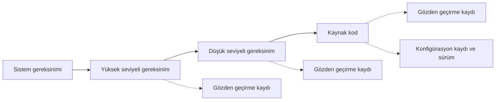

SOI-2, otoritenin geliştirme verisine ilk kez yakından baktığı denetimdir: gereksinim,
tasarım ve kod planlarda söylendiği gibi mi üretiliyor, standartlara uyuyor mu,
birbirine izlenebilir mi ve gözden geçirmeler gerçekten iş görüyor mu? Bu sayfa,
SOI-2 öncesinde ekibin kendi verisini sınamak için kullanabileceği bir kontrol
listesidir.

Katılım aşaması (Stage of Involvement, SOI) denetimlerinin genel mantığı
[12. Sertifikasyon İrtibatı](../03-do178c-ile-gelistirme/12-sertifikasyon-irtibati.md)
bölümünde anlatılır. Aşağıdaki maddeler bir otorite listesinin çevirisi değil, sahada
işe yarayan hazırlık sorularıdır; kapsam otoriteye ve yazılım seviyesine göre değişir.

:::tip[Örneklemeye hazırlanın]
SOI-2'de otorite veriyi baştan sona okumaz, örnekler. Tipik yöntem, rastgele seçilen
bir gereksinimin izini sistem gereksiniminden koda kadar aşağı, bir kod parçasının
izini de gereksinime kadar yukarı sürmektir. Bu iki yönlü izi araç üzerinde dakikalar
içinde gösteremiyorsanız, denetim o noktada uzar.
:::

## Ne zaman yapılır?

SOI-2'nin amacı süreci erken sınamaktır; bu yüzden geliştirmenin bitmesi beklenmez.
Pratikte gereksinim, tasarım ve kodun anlamlı bir kısmı (çoğu projede yarısı civarı)
üretilip gözden geçirildiğinde yapılır. Tipik giriş kriterleri:

- [ ] SOI-1 bulguları kapatılmış ya da kapanış planı otoriteyle mutabık kalınmıştır.
- [ ] Yüksek seviyeli gereksinimlerin (high-level requirements) önemli bir bölümü,
      bunlara karşılık gelen tasarım ve kod üretilmiş ve gözden geçirilmiştir.
- [ ] Örnek alınabilecek uçtan uca en az birkaç işlev vardır (gereksinimden koda).
- [ ] İzlenebilirlik (traceability) verisi araç üzerinde güncel ve sorgulanabilir
      durumdadır.
- [ ] Kalite güvencesi, geliştirme sürecinde en az bir denetim yapmış ve kaydını
      tutmuştur.

## Geliştirme verisi: otoritenin baktığı noktalar

### Gereksinimler

- [ ] Yüksek seviyeli gereksinimler sistem gereksinimlerine, düşük seviyeli
      gereksinimler (low-level requirements) yüksek seviyeli gereksinimlere izlenebilir
      mi?
- [ ] Gereksinimler doğrulanabilir mi; her biri test ya da analizle "karşılandı /
      karşılanmadı" diye yanıtlanabilir mi?
- [ ] Türetilmiş gereksinimler (derived requirements) işaretlenmiş, gerekçelendirilmiş
      ve sistem emniyet değerlendirmesine geri bildirilmiş mi?
- [ ] Yüksek seviyeli gereksinimler tasarım ayrıntısı (fonksiyon adı, değişken)
      içermiyor mu?
- [ ] Gereksinim standardına uyum gözden geçirmede kontrol edilmiş mi?

### Tasarım ve mimari

- [ ] Yazılım mimarisi (software architecture) bileşenleri, arayüzleri, veri ve kontrol
      akışını gösteriyor mu?
- [ ] Bölümleme ya da koruma mekanizması iddia ediliyorsa tasarımda nerede
      sağlandığı görünüyor mu?
- [ ] Düşük seviyeli gereksinimler, kodun gereksinim dışında karar vermesine gerek
      bırakmayacak kadar ayrıntılı mı?
- [ ] Tasarım standardındaki kısıtlara (karmaşıklık, kesme, dinamik bellek) uyulmuş mu?

### Kaynak kod

- [ ] Kaynak kod (source code) düşük seviyeli gereksinimlere izlenebilir mi; hiçbir
      gereksinime bağlanmayan kod var mı?
- [ ] Kodlama standardına uyum araçla denetlenmiş, sapmalar gerekçelendirilmiş mi?
- [ ] Kod ile tasarım arasında fark var mı (tasarımda olmayan bir işlev, farklı bir
      arayüz)?
- [ ] Derleme seçenekleri ve araç sürümleri planda yazılanlarla aynı mı?

### Gözden geçirmeler

- [ ] Her gözden geçirme kaydında incelenen ürünün sürümü, katılımcılar, kullanılan
      kontrol listesi, bulgular ve kapanış var mı?
- [ ] Yazılım seviyesinin gerektirdiği yerlerde gözden geçiren, yazardan bağımsız mı?
- [ ] Bulgular gerçekten kapatılmış ve kapanış doğrulanmış mı?
- [ ] Kontrol listeleri madde madde doldurulmuş mu, yoksa tek bir "uygundur" ile mi
      geçilmiş?

### Süreçler

- [ ] Geliştirme verisi temel çizgiye (baseline) alınıyor ve değişiklikler kontrol
      altında yapılıyor mu?
- [ ] Problem raporları (problem reports) planda tanımlandığı gibi açılıyor,
      sınıflandırılıyor ve izleniyor mu?
- [ ] Plandan yapılan sapmalar kayıt altında mı; gerekiyorsa planlar güncellenmiş mi?
- [ ] Kalite güvencesi, planlara uyumu denetlemiş ve uygunsuzlukları kayda geçirmiş mi?

## İz sürme alıştırması

Denetimden önce aşağıdaki akışı birkaç rastgele gereksinim için kendiniz yürütün.
Herhangi bir okta takılıyorsanız, otorite de aynı yerde takılacaktır.

## Hazırlanacak veri paketi

| Veri | Neden istenir |
|---|---|
| Yüksek ve düşük seviyeli gereksinimler | Gereksinim kalitesi ve standart uyumu |
| Mimari ve tasarım verisi | Gereksinimlerin nasıl gerçekleştirildiği |
| Kaynak kod ve kodlama standardı denetim çıktıları | Kodun standarda ve tasarıma uyumu |
| İzlenebilirlik verisi | İki yönlü iz sürme |
| Gözden geçirme kayıtları ve kontrol listeleri | Doğrulamanın geliştirmeyle birlikte yürüdüğünün kanıtı |
| Problem raporları ve değişiklik kayıtları | Sorunların sistematik yönetildiği |
| Temel çizgi ve konfigürasyon kayıtları | İncelenen verinin hangi sürüme ait olduğu |
| Kalite güvencesi denetim kayıtları | Süreç uyumunun bağımsız olarak izlendiği |

## Sık görülen bulgular

| Bulgu | Tipik nedeni | Önlem |
|---|---|---|
| Gözden geçirme kayıtlarında hiç bulgu yok | Gözden geçirmenin onay formalitesine dönüşmesi | Bulgusuz kayıtları kalite güvencesinin örneklemesi; kontrol listesinin madde madde doldurulması |
| İzlenebilirlik toplu bağlantılarla kurulmuş ("bu modül şu 40 gereksinimi karşılar") | İzin sonradan, toplu olarak eklenmesi | İzi gereksinim yazılırken ve kod değişirken güncellemek |
| Türetilmiş gereksinimler emniyet değerlendirmesine iletilmemiş | Yazılım ve sistem ekipleri arasında geri besleme kanalı olmaması | Türetilmiş gereksinimler için ayrı bir onay adımı tanımlamak |
| Kod tasarımdan farklı | Kodun değiştirilip tasarımın güncellenmemesi | Değişiklik etki analizinde tasarımı zorunlu kalem yapmak |
| Problem raporu yerine e-posta ya da sözlü düzeltme | Raporlama sürecinin ağır görülmesi | Hafif ama tek bir problem raporu akışı; kalite güvencesinin bunu denetlemesi |
| Plan dışı araç ya da derleme seçeneği kullanılmış | Planın güncellenmeden pratiğin değişmesi | Sapmayı kayda almak, planı yeni sürümle yayımlamak |

## Denetimden sonra

SOI-2 bulguları çoğu zaman tekil hatalara değil, süreç boşluklarına işaret eder.
Düzeltici faaliyet yazılırken "bu kayıt düzeltildi" demek yetmez; aynı hatanın başka
verilerde de olup olmadığı taranmalı ve süreç (kontrol listesi, araç ayarı, eğitim)
buna göre değiştirilmelidir. SOI-2'den açık bulguyla SOI-3'e girmek, doğrulama
kanıtının dayandığı verinin sorgulanması demektir.

## İlgili bölümler

- [6. Yazılım Gereksinimleri](../03-do178c-ile-gelistirme/06-yazilim-gereksinimleri.md)
- [7. Yazılım Tasarımı](../03-do178c-ile-gelistirme/07-yazilim-tasarimi.md)
- [8. Yazılım Gerçekleştirme: Kodlama ve Entegrasyon](../03-do178c-ile-gelistirme/08-yazilim-gerceklestirme-kodlama-entegrasyon.md)
- [10. Yazılım Konfigürasyon Yönetimi](../03-do178c-ile-gelistirme/10-yazilim-konfigurasyon-yonetimi.md)
- Önceki aşama: [SW SOI-1](soi-1.md) · Sonraki aşama: [SW SOI-3](soi-3.md)
