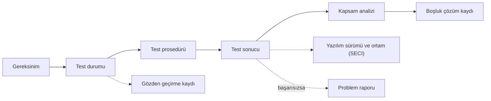

SOI-3, otoritenin doğrulama kanıtını incelediği denetimdir: testler gereksinimlerden
mi türetilmiş, normal ve gürbüzlük durumlarını kapsıyor mu, sonuçlar doğru yazılım
sürümüne ait mi ve kapsam analizi geride açıklanamamış bir boşluk bırakıyor mu? Bu
sayfa, SOI-3 öncesinde doğrulama verisini sınamak için bir kontrol listesi sunar.

Katılım aşaması (Stage of Involvement, SOI) denetimlerinin genel mantığı
[12. Sertifikasyon İrtibatı](../03-do178c-ile-gelistirme/12-sertifikasyon-irtibati.md)
bölümünde, doğrulamanın kendisi
[9. Yazılım Doğrulama](../03-do178c-ile-gelistirme/09-yazilim-dogrulama.md)
bölümünde anlatılır. Buradaki maddeler bir otorite listesinin çevirisi değil, sahada
işe yarayan hazırlık sorularıdır; hangi maddenin geçerli olduğu otoriteye ve yazılım
seviyesine (software level) göre değişir, seviyeye bağlı maddelerde bu ayrıca
belirtilmiştir.

:::tip[Örnekleme bu kez testten başlar]
SOI-3'te otorite çoğu zaman bir gereksinim seçer ve sorar: Bu gereksinimi hangi
testler sınıyor, beklenen sonuç nereden geliyor, test hangi yazılım sürümünde, hangi
ortamda koştu, sonuç nerede kayıtlı, kapsam analizinde bu kodun durumu ne? Bu zinciri
her halkasıyla gösterebilmek, SOI-3 hazırlığının özüdür.
:::

## Ne zaman yapılır?

SOI-3 için doğrulamanın bitmesi beklenmez; denetim, doğrulama verisinin temsil edici
bir bölümü tamamlanıp gözden geçirildiğinde ve yapısal kapsam analizi (structural
coverage analysis) sonuç üretmeye başladığında yapılır. "Temsil edici bölüm" için
FAA'nın yazılım onay yönergesi (Order 8110.49) tipik olarak en az yarısını, EASA'nın
artık yürürlükte olmayan CM-SWCEH-002 sertifikasyon notu ise en az dörtte üçünü
anıyordu; projede geçerli eşik, yazılım sertifikasyon planında (Plan for Software
Aspects of Certification, PSAC) otoriteyle kararlaştırılır. Tipik giriş kriterleri:

- [ ] SOI-2 bulguları kapatılmış ya da kapanış planında otoriteyle mutabık kalınmıştır.
- [ ] Test durumlarının (test cases) ve test prosedürlerinin (test procedures)
      kararlaştırılan eşiği karşılayan bölümü yazılmış, gözden geçirilmiş ve kredi
      amaçlı (for-credit) olarak koşulmuştur.
- [ ] Gereksinim kapsam analizi ve yapısal kapsam analizi, koşulan testler için sonuç
      vermiştir; bulunan boşluklar sınıflandırılmaktadır ve örnek gösterilebilecek
      çözülmüş boşluk kayıtları vardır.
- [ ] Test ortamı ve araçları yazılım yaşam döngüsü ortam konfigürasyon indeksinde
      (Software Life Cycle Environment Configuration Index, SECI) tanımlıdır.
- [ ] Zamanlama, yığın ve bellek analizleri gibi test dışı doğrulama çalışmalarının
      yöntemi belirlenmiş ve ilk sonuçları alınmıştır.

## Doğrulama verisi: otoritenin baktığı noktalar

### Testlerin türetilmesi

- [ ] Her test durumu bir ya da daha fazla gereksinime izlenebilir mi; gereksinimi
      olmayan test var mı?
- [ ] Beklenen sonuçlar gereksinimden mi türetilmiş, yoksa kodun gerçek çıktısından mı
      kopyalanmış?
- [ ] Normal aralık testlerinin yanında gürbüzlük (robustness) testleri var mı:
      geçersiz ve sınır dışı girdiler, bozuk veri, anormal başlatma, aşılan çerçeve
      süresi, izin verilmeyen durum geçişleri?
- [ ] Normal aralık testlerinde geçerli eşdeğerlik sınıfları (equivalence classes) ve
      sınır değerleri (boundary values) bilinçli olarak seçilmiş mi?
- [ ] Testler ve prosedürler gözden geçirilmiş; gözden geçirme kaydı var mı?

### Testlerin koşulması ve sonuçlar

- [ ] Test sonuçları, hangi yazılım sürümüyle, hangi ortamda ve hangi prosedür
      sürümüyle elde edildiklerini açıkça gösteriyor mu?
- [ ] Beklenen sonuçla gerçekleşen sonuç arasındaki her fark açıklanmış mı; başarısız
      testler problem raporuyla (problem report) ilişkilendirilmiş mi?
- [ ] Kod değiştikten sonra hangi testlerin yeniden koşulduğu bir regresyon analiziyle
      (regression analysis) gerekçelendirilmiş mi?
- [ ] Yazılım–donanım entegrasyon testleri hedef donanımda mı yapılmış; benzetici ya da
      emülatörden kredi alındıysa hedeften farkların hata yakalama yeteneğine etkisi
      değerlendirilmiş, orada yakalanamayacak hatalar için planda belirtilen başka
      doğrulama faaliyeti yapılmış mı?
- [ ] Test prosedürleri, başka bir kişi tarafından aynı sonuçla tekrarlanabilecek
      kadar açık mı?

### Kapsam analizi

- [ ] Gereksinim kapsam analizi, her gereksinimin test edildiğini (ya da neden analiz
      veya gözden geçirmeyle karşılandığını) gösteriyor mu?
- [ ] Yapısal kapsam, yazılım seviyesinin gerektirdiği ölçütle ölçülmüş mü: Seviye C'de
      satır kapsama (statement coverage), Seviye B'de buna ek olarak karar kapsama
      (decision coverage), Seviye A'da ek olarak değiştirilmiş koşul/karar kapsama
      (modified condition/decision coverage, MC/DC)?
- [ ] Kapsam verisi gereksinim tabanlı testlerden mi toplanmış; yalnızca boşluğu
      kapatmak için koda bakarak yazılmış, gereksinime izlenemeyen test var mı?
- [ ] Kapsam boşlukları sınıflandırılmış mı: eksik test, eksik gereksinim, ölü kodu
      (dead code) da içeren gereksiz kod (extraneous code), devre dışı bırakılmış kod
      (deactivated code)?
- [ ] Her boşluk için çözüm (yeni test, gereksinim değişikliği, kod kaldırma ya da
      gerekçeli analiz) kayıt altında mı?
- [ ] Kapsam ölçümü kod enstrümantasyonu (instrumentation) ile yapıldıysa, enstrümante
      edilmiş ve edilmemiş kod arasındaki farkın etkisi tartışılmış mı?
- [ ] Seviye A'da, derleyicinin ya da bağlayıcının ürettiği ve kaynak koda doğrudan
      izlenemeyen nesne kodu belirlenmiş ve doğruluğu ek doğrulamayla gösterilmiş mi;
      böyle kod yoksa bunu gösteren analiz var mı?
- [ ] Seviye A, B ve C'de veri bağlaşımı ve kontrol bağlaşımı (data coupling and
      control coupling) analizi, mimaride tanımlı bileşen arası ilişkilerin testlerde
      gerçekten işletildiğini gösteriyor mu?

Seviye D'de yapısal kapsam hedefi yoktur; bu grupta yalnızca yüksek seviyeli
gereksinimlerin test kapsamı sorulur (düşük seviyeli gereksinimlerin test kapsamı Seviye
A, B ve C'de aranır). Ölçütlerin ne istediği 9. bölümde, boşluk sınıflarının ayrıntısı
[17. Kapsanmayan Kodlar: Ölü, Gereksiz ve Devre Dışı Bırakılmış Kodlar](../05-ozel-konular/17-kapsanmayan-kodlar.md)
bölümünde anlatılır.

### Analizler ve araçlar

- [ ] En kötü durum yürütme süresi (worst-case execution time, WCET) ve yığın kullanımı
      analizle belirlenip ölçümle desteklenmiş, bellek haritası analizi yapılmış ve
      sonuçlar gereksinimlerle karşılaştırılmış mı?
- [ ] Gözden geçirme ve analiz sonuçları da doğrulama sonuçları arasında kayıtlı mı ve
      hangi veri sürümüne ait oldukları belli mi?
- [ ] Parametre verisi öğesi (parameter data item, PDI) dosyaları varsa, yapıları,
      öznitelikleri ve içerdikleri değerler doğrulanmış, dosyanın tüm öğeleri bu
      doğrulamada kapsanmış mı (bkz.
      [22. Konfigürasyon Verisi](../05-ozel-konular/22-konfigurasyon-verisi.md))?
- [ ] Test ve kapsam araçlarının kalifikasyon gerekip gerekmediği değerlendirilmiş;
      gerekiyorsa kalifikasyon verisi hazır mı?
- [ ] Bağımsızlığın arandığı doğrulama hedeflerinde (Seviye A ve B) bağımsızlık
      sağlanmış ve kayıtlardan izlenebilir mi?

### Problem raporları ve süreçler

- [ ] Doğrulamada bulunan her kusur (başarısız test, kontrol altındaki veride gözden
      geçirme bulgusu, analizde çıkan sapma) problem raporuyla kayda alınmış mı?
- [ ] Raporlar planda tanımlandığı gibi sınıflandırılmış; emniyet etkisi olabilecekler
      sistem emniyet değerlendirme sürecine geri bildirilmiş mi?
- [ ] Kapatılan raporlarda düzeltmenin nasıl doğrulandığı (yeniden koşulan testler,
      değişiklik etki analizi (change impact analysis)) kayıttan izlenebiliyor mu?
- [ ] Test durumları, prosedürleri, sonuçları ve test ortamı konfigürasyon yönetimi
      altında mı; kredi amaçlı koşular temel çizgiye (baseline) alınmış veriyle mi
      yapılmış?
- [ ] Kalite güvencesi, kredi amaçlı koşulara tanıklık etmiş ya da kayıtlarını
      denetlemiş; bulduğu uygunsuzlukları kayda geçirmiş mi?

Açık kalacak raporların sınıflandırılması ve gerekçelendirilmesi asıl olarak SOI-4'ün
konusudur; sınıflar 9. bölümün problem raporlama kısmında tanımlanır.

## İz sürme alıştırması

Denetimden önce aşağıdaki akışı birkaç rastgele gereksinim için kendiniz yürütün; sonra
ters yönden, rastgele seçtiğiniz bir test sonucundan gereksinime doğru deneyin.
Herhangi bir okta takılıyorsanız, otorite de aynı yerde takılacaktır.

## Hazırlanacak veri paketi

| Veri | Neden istenir |
|---|---|
| Yazılım doğrulama durumları ve prosedürleri (Software Verification Cases and Procedures, SVCP) | Testlerin gereksinimden türetildiğini ve tekrarlanabilir olduğunu gösterir |
| Yazılım doğrulama sonuçları (Software Verification Results, SVR) | Hangi sürüm ve ortamda neyin geçtiği |
| Gereksinim–test izlenebilirlik verisi | Her gereksinimin hangi testle sınandığı |
| Gereksinim ve yapısal kapsam analizi sonuçları | Testlerin yeterliliği ve boşlukların çözümü |
| Zamanlama, yığın ve bellek analizleri | Test dışı doğrulama hedefleri |
| Test ortamı tanımı ve SECI | Sonuçların yeniden üretilebilirliği |
| Araç kalifikasyon verisi (gerekiyorsa) | Araç çıktısına duyulan güvenin dayanağı |
| Problem raporları | Bulunan hataların sistematik yönetildiği |
| Gözden geçirme ve kalite güvencesi kayıtları | Doğrulama sürecinin de denetlendiği |

## Sık görülen bulgular

| Bulgu | Tipik nedeni | Önlem |
|---|---|---|
| Beklenen sonuçlar kodun çıktısından alınmış | Testin kod yazıldıktan sonra, koda bakarak yazılması | Beklenen sonucun kaynağını test durumunda gereksinime bağlamak; gözden geçirmede sormak |
| Gürbüzlük testleri yetersiz | Testin yalnızca "mutlu yol" için yazılması | Gürbüzlük kategorilerini doğrulama planına ve test gözden geçirme kontrol listesine koymak |
| Sonuçlar temel çizgideki sürümle eşleşmiyor | Kod değiştikten sonra testlerin yeniden koşulmaması | Kredi amaçlı koşuları yalnızca temel çizgiye alınmış sürümlerle yapmak |
| Kapsam boşlukları "analizle karşılandı" deyip geçilmiş | Analiz kaydının ve gerekçenin yazılmaması | Her boşluk için tekil, gözden geçirilmiş bir çözüm kaydı |
| Yapısal kapsam, koda bakarak yazılmış testlerle doldurulmuş | Boşluğun nedenini aramak yerine yüzdeyi kapatma isteği | Boşluğu önce sınıflandırmak; eklenen her testi bir gereksinime izlemek |
| Başarısız test yeniden koşulup geçmiş, geride kayıt yok | Hatanın testte mi kodda mı olduğu kaydedilmeden düzeltilmesi | Kredi amaçlı koşudaki her başarısızlığa problem raporu; kapanışta yeniden doğrulama kaydı |
| Hedef dışı ortamda test, gerekçesiz | Hedef donanımın geç gelmesi | Ortam farklarını analiz eden ve kritik testleri hedefte tekrarlayan bir plan |
| Araç kalifikasyonu unutulmuş | Test aracının "yalnızca yardımcı" sayılması | Aracın çıktısı bir doğrulama adımının yerine geçiyor mu sorusunu SOI-1'de yanıtlamak |

## Denetimden sonra

SOI-3 bulguları genellikle ek test, ek analiz ya da yeniden koşu gerektirir ve takvimi
doğrudan etkiler. Düzeltici faaliyetler (corrective action), SOI-4'e kadar
tamamlanabilecek biçimde planlanmalı; her biri, hangi kanıtın hangi sürümle yeniden
üretileceğini açıkça söylemelidir. SOI-4'te önceki aşamaların bulgularının kapanmış
olması beklenir; bu yüzden SOI-3'ten kalan her açık madde, son denetimin takvimine
doğrudan yazılmış bir iştir.

## İlgili bölümler

- [9. Yazılım Doğrulama](../03-do178c-ile-gelistirme/09-yazilim-dogrulama.md)
- [17. Kapsanmayan Kodlar: Ölü, Gereksiz ve Devre Dışı Bırakılmış Kodlar](../05-ozel-konular/17-kapsanmayan-kodlar.md)
- [13. DO-330 ve Yazılım Aracı Kalifikasyonu](../04-arac-kalifikasyonu-ve-ekler/13-do330-arac-kalifikasyonu.md)
- Önceki aşama: [SW SOI-2](soi-2.md) · Sonraki aşama: [SW SOI-4](soi-4.md)
