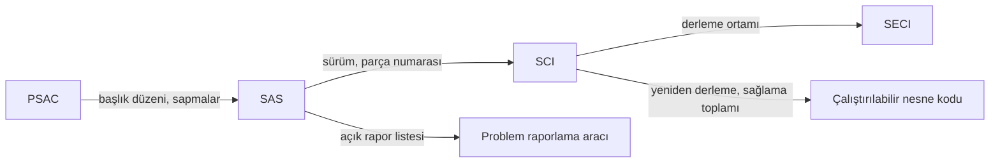

SOI-4, yazılımın sertifikasyona sunulmadan önceki son denetimidir: tüm faaliyetler
tamamlandı mı, önceki aşamaların bulguları kapandı mı, teslim edilen yazılım tam olarak
tanımlanmış ve yeniden üretilebilir mi, açık kalan problem raporları kabul edilebilir
mi? Bu sayfa, son denetim öncesinde sunum paketini sınamak için bir kontrol listesidir.

Katılım aşaması (Stage of Involvement, SOI) denetimlerinin genel mantığı ve yazılım
başarı özetinin (Software Accomplishment Summary, SAS) içeriği
[12. Sertifikasyon İrtibatı](../03-do178c-ile-gelistirme/12-sertifikasyon-irtibati.md)
bölümünde anlatılır. Buradaki maddeler bir otorite listesinin çevirisi değil, sahada
işe yarayan hazırlık sorularıdır.

:::tip[Son denetimde yeni konu açılmaz]
SOI-4'ün iyi geçmesinin sırrı, SOI-4'te yeni bir şey göstermemektir. Bu aşamada
otorite, daha önce gördüğü sürecin sonuna kadar aynı disiplinle işletildiğini ve sunulan
belgelerin birbiriyle, kayıtlarla ve gerçek yazılımla tutarlı olduğunu doğrular.
:::

## Ne zaman yapılır?

SOI-4, yazılım yaşam döngüsü faaliyetleri tamamlandığında ve sertifikasyona esas
sürüm belirlendiğinde yapılır. Tipik giriş kriterleri:

- [ ] SOI-1, SOI-2 ve SOI-3 bulgularının tamamı kapatılmış ve kapanış kanıtları
      dosyalanmıştır.
- [ ] Sertifikasyona esas yazılım sürümü son temel çizgiye (baseline) alınmıştır.
- [ ] Doğrulama bu sürüm için tamamlanmış, sonuçları gözden geçirilmiştir.
- [ ] SAS ve yazılım konfigürasyon indeksi (Software Configuration Index, SCI)
      yayımlanmıştır.
- [ ] Kalite güvencesi yazılım uygunluk gözden geçirmesini (software conformity
      review) tamamlamıştır.
- [ ] Açık problem raporlarının her biri sınıflandırılmış, emniyet ve işlev etkisi
      değerlendirilmiştir.

## Son paket: otoritenin baktığı noktalar

Son paketin belgeleri birbirine çapraz kontrollerle bağlıdır: yazılım sertifikasyon
planında (Plan for Software Aspects of Certification, PSAC) verilen söz SAS'ta
karşılığını bulur, SAS'ın andığı sürüm SCI'de tanımlanır, SCI'nin tanımladığı yazılım
da yazılım yaşam döngüsü ortam konfigürasyon indeksinde (Software Life Cycle Environment
Configuration Index, SECI) kayıtlı ortamda yeniden üretilir. Aşağıdaki sorular bu
bağların her birini sınar.

### Önceki aşamaların kapanışı

- [ ] Her önceki bulgu için ne yapıldığı, hangi kanıtla kapatıldığı ve kimin onayladığı
      tek bir listede görülebiliyor mu?
- [ ] Bir bulgunun düzeltilmesi başka bir veriyi değiştirdiyse o veri yeniden
      doğrulanmış mı?

### Doğrulamanın tamamlanması

SOI-3 doğrulamanın bir kesitini görür; SOI-4'te sorulan, o günden sonra yapılan
değişikliklerle birlikte doğrulamanın teslim edilen sürüm için hâlâ geçerli olup
olmadığıdır.

- [ ] Kredi için sunulan test ve analiz sonuçları son temel çizgideki çalıştırılabilir
      nesne kodu (executable object code) için mi geçerli; daha eski bir derlemede
      koşulan testler için değişiklik etki analizine (change impact analysis) dayanan
      bir yeniden test gerekçesi yazılmış mı?
- [ ] SOI-3'te açık kalan gereksinim kapsamı ve yapısal kapsam boşluklarının hepsi
      kapanmış mı?
- [ ] En kötü durum yürütme süresi (worst-case execution time, WCET), yığın ve bellek
      kullanımı analizleri son sürüm için güncel mi; kalan paylar SAS'ta yazılı mı?
- [ ] Kalifiye araçların kalifikasyon verisi tamamlanmış mı; kullanılan araç sürümleri
      SECI'dekilerle aynı mı; araçların bilinen problemleri ve işlevsel kısıtları
      yazılım açısından değerlendirilip SAS'ta raporlanmış mı?

### Yazılım başarı özeti (SAS)

- [ ] SAS, PSAC'ta verilen sözlerle aynı başlık düzeninde karşılaştırılabiliyor mu?
- [ ] Plandan yapılan tüm sapmalar, gerekçeleri ve onay kayıtlarıyla birlikte
      yazılmış mı?
- [ ] Yazılımın karşıladığı hedeflere ilişkin uyum beyanı açık mı; SAS'ta yazılı
      sapmalar, sınırlamalar ve açık problem raporlarıyla tutarlı mı?
- [ ] SAS, geçerli SCI'yi ve SECI'yi kimlik ve sürümleriyle açıkça anıyor mu; SAS'taki
      yazılım sürümü, parça numarası ve belge sürümleri SCI ile birebir aynı mı?

### Konfigürasyon ve yeniden üretilebilirlik

- [ ] SCI, çalıştırılabilir nesne kodunu ve onu üreten kaynak dosyalarını sürümleriyle
      tanımlıyor mu?
- [ ] SECI, derleyiciyi, bağlayıcıyı, derleme seçeneklerini ve kalifiye araçları
      sürümleriyle listeliyor mu?
- [ ] Belgelenen talimatlarla temiz bir ortamda yeniden derleme yapıldığında aynı
      çalıştırılabilir nesne kodu elde ediliyor mu (sağlama toplamı karşılaştırmasıyla);
      fark varsa kaynağı belirlenip açıklanmış mı?
- [ ] Yükleme talimatları ve yüklenebilir yazılım parçasının (loadable software part,
      LSP) tanımlaması doğru mu; hedefe yüklenen sürümün doğruluğu nasıl kontrol
      ediliyor?
- [ ] Yaşam döngüsü verisi arşivlenmiş ve arşivden geri alınabildiği denenmiş mi?

### Açık problem raporları

Açık raporların sınıfları ve değerlendirme soruları
[9. Yazılım Doğrulama](../03-do178c-ile-gelistirme/09-yazilim-dogrulama.md) bölümünde
tanımlanır; burada yalnızca son pakette aranan tutarlılık sorulur.

- [ ] SAS'taki açık problem raporu listesi, problem raporlama aracındaki kayıtla aynı
      mı; liste SCI'de ya da sürüm notunda da veriliyorsa oradaki de aynı mı?
- [ ] Her açık rapor, planlarda tanımlı ve FAA AC 20-189 / EASA AMC 20-189 ile uyumlu
      şemaya göre tek bir sınıfa atanmış mı: önemli (significant), işlevsel
      (functional), süreç (process) ya da yaşam döngüsü verisi (life-cycle data)?
- [ ] Her açık rapor için etkilenen işlev, getirdiği kısıt ve neden bu hâliyle kabul
      edilebilir olduğu yazılmış mı?
- [ ] "Önemli" sınıfında açık rapor kalmış mı; kaldıysa sistem düzeyindeki
      hafifletmelere ve işletme kısıtlarına dayanan yeterli bir gerekçesi var mı?
- [ ] Kapatılmış raporların kapanış kanıtı (düzeltme, yeniden doğrulama) izlenebilir mi?

### Kalite güvencesi

Yazılım uygunluk gözden geçirmesi, kalite güvencesinin sertifikasyona sunulan sürüm
için yaptığı son kontroldür ve Seviye A'dan Seviye D'ye kadar her yazılım seviyesinde
aranır. Yeni bir teknik doğrulama değildir; var olan kayıtların eksiksiz ve birbiriyle
tutarlı olduğunu üç yönden teyit eder:

| Yön | Sorulan |
|---|---|
| Süreç | Kredi için planlanan faaliyetler tamamlanmış ve kayıtları duruyor mu; kayda geçmemiş ya da onaylanmamış bir gereksinim sapması kalmış mı? |
| Veri | Yaşam döngüsü verisi planlara ve standartlara göre üretilmiş, kaynaklandığı gereksinimlere izlenebilir ve konfigürasyon kontrolü altında mı; problem raporları (önceki bir uygunluk gözden geçirmesinden ertelenenler dahil) değerlendirilmiş ve durumları kayıtlı mı? |
| Ürün | Çalıştırılabilir nesne kodu ile varsa parametre verisi öğesi (parameter data item, PDI) dosyaları arşivlenmiş kaynak koddan yeniden üretilebiliyor ve yayımlanmış yükleme talimatıyla yüklenebiliyor mu? |

Bu yüzden son temel çizgiden önce yapılan bir uygunluk gözden geçirmesi, sunulan sürüm
hakkında bir şey söylemez.

- [ ] Uygunluk gözden geçirmesi son temel çizgi üzerinde mi yapılmış; ondan sonra
      değişiklik olmuşsa gözden geçirme tekrarlanmış mı?
- [ ] Kalite güvencesinin açtığı uygunsuzlukların hepsi kapanmış mı?
- [ ] Tedarikçilerden gelen veri için gözetim kayıtları tamam mı?
- [ ] Önceden geliştirilmiş yazılımdan (previously developed software, PDS) kredi
      alınıyorsa, güncel temel çizgi önceki temel çizgiye ve onaylı değişikliklere
      izlenebiliyor mu?

## Hazırlanacak veri paketi

| Veri | Neden istenir |
|---|---|
| Yazılım başarı özeti (SAS) | Projenin PSAC'a göre nasıl tamamlandığının özeti |
| Yazılım konfigürasyon indeksi (SCI) ve SECI | Teslim edilen yazılımın ve yaşam döngüsü ortamının tam tanımı |
| Araç konfigürasyon indeksi (Tool Configuration Index, TCI) ve araç başarı özeti (Tool Accomplishment Summary, TAS) | Araç kalifikasyon seviyesi (tool qualification level, TQL) TQL-1 ile TQL-4 arasında olan araç varsa: kalifikasyonun planlandığı gibi tamamlandığı; DO-330 bu ikisinin otoriteye sunulmasını bekler |
| Son temel çizgiye ait doğrulama sonuçları ve kapsam analizi | Doğrulamanın teslim edilen sürüm için tamamlandığı |
| Açık problem raporları ve değerlendirmeleri | Bilinen kusurların kabul edilebilirliği |
| Önceki SOI bulgularının kapanış kayıtları | Sürecin tutarlı işletildiği |
| Uygunluk gözden geçirmesi kaydı | Kalite güvencesinin son kontrolü |
| Yeniden derleme ve yükleme kanıtı | Teslim edilen yazılımın yeniden üretilebilirliği |
| Konfigürasyon yönetimi ve arşiv kayıtları | Verinin korunduğu ve geri alınabildiği |

## Sık görülen bulgular

| Bulgu | Tipik nedeni | Önlem |
|---|---|---|
| SAS ile SCI arasında sürüm ya da parça numarası farkı | Belgelerin farklı zamanlarda elle güncellenmesi | SCI'yi derleme altyapısından üretmek; SAS'ı SCI'ye başvurarak yazmak |
| Açık problem raporu listesi SAS'ta ve araçta farklı | Listenin araçtan bir kez çekilip sonra güncellenmemesi | Listeyi tek kaynaktan, son temel çizgi tarihinde üretmek |
| Açık raporların sınıfı ya da kabul gerekçesi eksik | Değerlendirmenin son haftaya bırakılması | Raporları açıldıkları anda sınıflandırmak; açık kalacakları düzenli gözden geçirmek |
| Zamanlama ya da yığın analizi eski bir sürüme ait | Son değişikliklerden sonra analizin yenilenmemesi | Değişiklik etki analizinde analiz raporlarını da etkilenen veri olarak listelemek |
| Uygunluk gözden geçirmesi son değişiklikten önce yapılmış | Takvim baskısıyla gözden geçirmenin öne çekilmesi | Son değişiklikten sonra gözden geçirmenin tekrarını giriş kriteri yapmak |
| Yeniden derleme aynı çalıştırılabilir nesne kodunu üretmiyor | Kayıt dışı derleme seçeneği, ortam farkı, zaman damgası | Yeniden derlemeyi SOI-4'ten önce temiz ortamda denemek |
| Plan sapması SAS'ta yok | Sapmanın proje sırasında kayda alınmaması | Sapmaları oluştukları anda kalite güvencesi kaydına bağlamak |

## Denetimden sonra

SOI-4 sonunda otorite, yazılım açısından sertifikasyona engel bir durum kalmadığını
kayda geçirir; yazılım onayı, ait olduğu sistemin ya da ekipmanın onay sürecinin
parçası olarak tamamlanır. Bundan sonra yapılacak her değişiklik, değişiklik etki
analiziyle başlayan ayrı bir süreçtir.

## İlgili bölümler

- [9. Yazılım Doğrulama](../03-do178c-ile-gelistirme/09-yazilim-dogrulama.md)
- [10. Yazılım Konfigürasyon Yönetimi](../03-do178c-ile-gelistirme/10-yazilim-konfigurasyon-yonetimi.md)
- [11. Yazılım Kalite Güvencesi](../03-do178c-ile-gelistirme/11-yazilim-kalite-guvencesi.md)
- [12. Sertifikasyon İrtibatı](../03-do178c-ile-gelistirme/12-sertifikasyon-irtibati.md)
- [18. Sahada Yüklenebilir Yazılım](../05-ozel-konular/18-sahada-yuklenebilir-yazilim.md)
- Önceki aşama: [SW SOI-3](soi-3.md)
